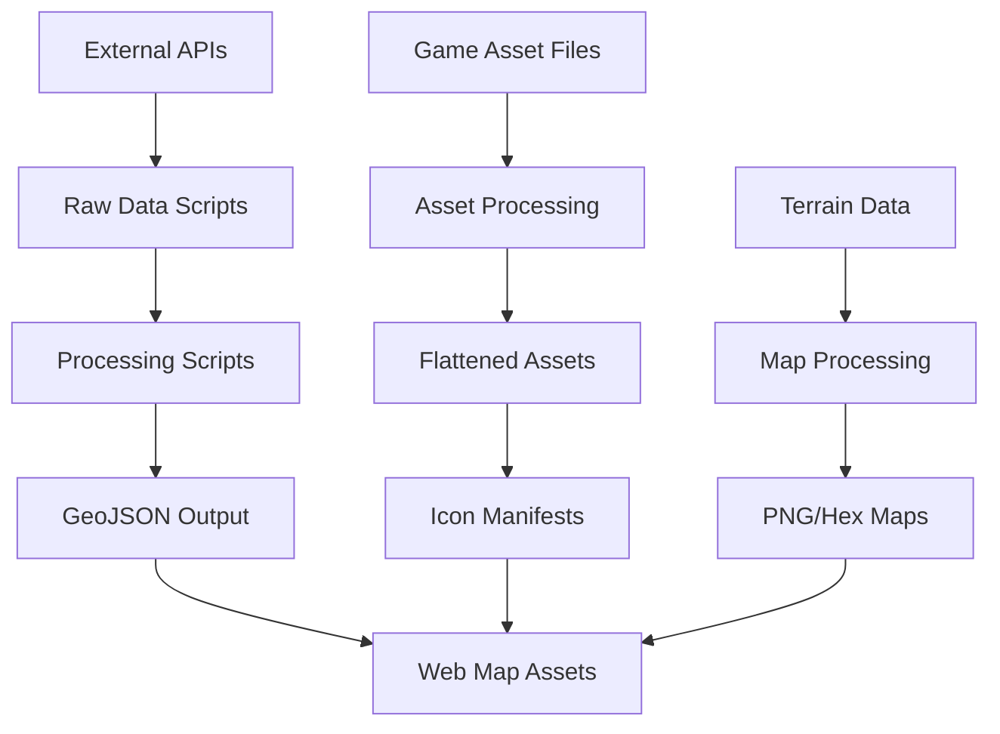

# BitCraft Map Scripts Documentation

## Overview

The BitCraft Map project includes a comprehensive collection of Python scripts and utilities designed to process, convert, and generate various map-related data assets. These scripts form the backbone of the data pipeline that powers the interactive BitCraft game map, transforming raw game data into web-ready formats.

## Architecture Overview

The scripts ecosystem is organized into several functional categories:

### 🔄 Data Processing Pipeline
- **Claims Processing**: Fetches and transforms player claim data from APIs
- **Jobs/Crafts Processing**: Processes game profession and crafting data  
- **Resource Processing**: Handles resource node and cave data transformation
- **POI Processing**: Converts static Points of Interest to GeoJSON format

### 🗺️ Map Generation
- **Grid Generation**: Creates coordinate grids and region boundaries
- **Terrain Processing**: Processes terrain map files into web-ready formats
- **Road Generation**: Generates hexagonal road networks from coordinate data

### 🛠️ Asset Management
- **Asset Flattening**: Consolidates nested asset directories
- **Icon Manifest**: Generates JavaScript manifests for map icons
- **Data Cleaning**: Removes unnecessary fields from large datasets

### 🚀 Automation
- **Shell Scripts**: Automated workflows for multi-region processing
- **Batch Operations**: Coordinated execution of related processing tasks

## Dependencies

All Python scripts require the dependencies specified in [`requirements.txt`](../scripts/requirements.txt:1):

```txt
matplotlib
numpy
requests
opencv-python
pillow
pandas
```

Additional dependencies for specific scripts:
- **shapely**: Required for [`generate_roads.py`](../scripts/generate_roads.py:19)
- **scipy**: Optional for performance optimization in road generation

## Common Data Flow



## Output Directories

Scripts generate outputs in standardized locations:

- **`assets/markers/`**: GeoJSON files for map markers
- **`assets/data/`**: Processed data files and terrain maps  
- **`assets/images/`**: Icon assets and manifest files
- **Root directory**: Temporary processing files (region*.json, etc.)

## Script Categories

### Core Data Processing Scripts

| Script | Purpose | Input | Output |
|--------|---------|-------|--------|
| [`generate_claims_geojson.py`](generate_claims_geojson.py.md) | Player claim data | BitJita API | `claims.geojson` |
| [`generate_jobs_geojson.py`](generate_jobs_geojson.py.md) | Crafting jobs | BitJita API | `jobs.geojson` |
| [`static_poi_to_geojson.py`](static_poi_to_geojson.py.md) | Static POIs | `caves.json` | Multiple GeoJSON files |
| [`generate_grids_geojson.py`](generate_grids_geojson.py.md) | Map grids | Hardcoded parameters | `grids.geojson` |

### Asset Management Scripts

| Script | Purpose | Input | Output |
|--------|---------|-------|--------|
| [`generate_assets.py`](generate_assets.py.md) | Flatten assets | Asset directories | Flattened structure |
| [`generate_icons_manifest.py`](generate_icons_manifest.py.md) | Icon catalog | `assets/images/` | `manifest.js` |

### Data Processing Utilities

| Script | Purpose | Input | Output |
|--------|---------|-------|--------|
| [`generate_csv_desc_file.py`](generate_csv_desc_file.py.md) | Clean enemy data | External JSON API | CSV + cleaned JSON |
| [`generate_resource_csv_desc.py`](generate_resource_csv_desc.py.md) | Process resources | `resource_desc.json` | CSV + names JSON |

### Map Generation Scripts

| Script | Purpose | Input | Output |
|--------|---------|-------|--------|
| [`generate_terrain_map.py`](generate_terrain_map.py.md) | Terrain processing | Remote `.gwm` files | PNG + hex maps |
| [`generate_roads.py`](generate_roads.py.md) | Hexagonal roads | Coordinate JSON | GeoJSON MultiPolygon |

### Automation Scripts

| Script | Purpose | Input | Output |
|--------|---------|-------|--------|
| [`roads.sh`](roads.sh.md) | Road automation | Local API endpoints | Multiple road GeoJSON |

## Performance Considerations

### Memory Usage
- **Large Dataset Processing**: Claims and jobs scripts can handle 10,000+ records
- **Terrain Processing**: Requires ~200MB RAM for 2400x2400 terrain maps
- **Batch Operations**: Road generation uses configurable batch sizes (default: 5000)

### API Rate Limiting
- **BitJita API**: Implements 0.5s delays between requests
- **User-Agent Headers**: Uses identifiable user agents for API compliance
- **Error Handling**: Robust retry logic for network operations

### Optimization Features
- **Spatial Indexing**: KDTree acceleration for nearest-neighbor calculations
- **Grid Optimization**: Integer coordinate fast paths for common cases
- **Batch Processing**: Configurable union operations for large polygon sets

## Common Usage Patterns

### Full Data Pipeline Execution
```bash
# Install dependencies
pip install -r requirements.txt

# Process game data
python generate_claims_geojson.py
python generate_jobs_geojson.py  
python static_poi_to_geojson.py

# Generate map assets
python generate_grids_geojson.py
python generate_terrain_map.py
python generate_icons_manifest.py

# Process roads (requires local API servers)
./roads.sh
```

### Asset Management Workflow
```bash
# Flatten and organize assets
python generate_assets.py

# Generate icon manifest
python generate_icons_manifest.py
```

### Data Cleaning Operations
```bash
# Clean external data sources
python generate_csv_desc_file.py
python generate_resource_csv_desc.py
```

## Error Handling and Logging

### Common Error Patterns
- **Network Timeouts**: API scripts implement retry logic
- **File Not Found**: Scripts create necessary directories automatically
- **Memory Errors**: Large datasets use streaming/chunked processing
- **Coordinate Validation**: Robust bounds checking for map coordinates

### Debugging Features
- **Progress Indicators**: Real-time processing status for long operations
- **Verbose Logging**: Detailed output for troubleshooting
- **Intermediate Files**: Preserved for debugging complex pipelines

## Integration Points

### Web Map Integration
Scripts generate standardized GeoJSON that integrates directly with the Leaflet-based web map:

```javascript
// Example integration
L.geoJSON(claimsData, {
    pointToLayer: (feature, latlng) => {
        return L.marker(latlng, {
            icon: getClaimIcon(feature.properties.tier)
        });
    }
});
```

### API Endpoints
Several scripts expect local API endpoints for region-specific data:
- **Ports 4001-4009**: Regional paved road data
- **BitJita API**: External game data source

## Security Considerations

### API Keys and Authentication
- No hardcoded API keys in scripts
- User-Agent headers for API identification
- Rate limiting to prevent API abuse

### Data Sanitization
- Input validation for coordinate ranges
- File path sanitization for asset processing
- JSON parsing with error handling

## Future Enhancements

### Planned Improvements
- **Configuration Management**: Centralized configuration files
- **Parallel Processing**: Multi-threaded operations for large datasets
- **Data Validation**: Schema validation for input/output formats
- **Monitoring**: Performance metrics and health checks

### Extension Points
- **Custom Data Sources**: Plugin architecture for new APIs
- **Output Formats**: Support for additional geospatial formats
- **Processing Filters**: Configurable data filtering and transformation

## Troubleshooting Guide

### Common Issues
1. **Dependencies**: Ensure all packages in `requirements.txt` are installed
2. **Network Access**: Verify internet connectivity for API scripts
3. **File Permissions**: Check write permissions for output directories
4. **Memory Limits**: Monitor RAM usage for large dataset processing

### Debug Commands
```bash
# Test API connectivity
python -c "import requests; print(requests.get('https://bitjita.com/api/claims/?limit=1').status_code)"

# Verify dependencies
python -c "import PIL, cv2, numpy, requests, pandas; print('All dependencies available')"

# Check output directories
ls -la assets/{markers,data,images}/
```

For detailed documentation of individual scripts, see the specific script documentation files in this directory.