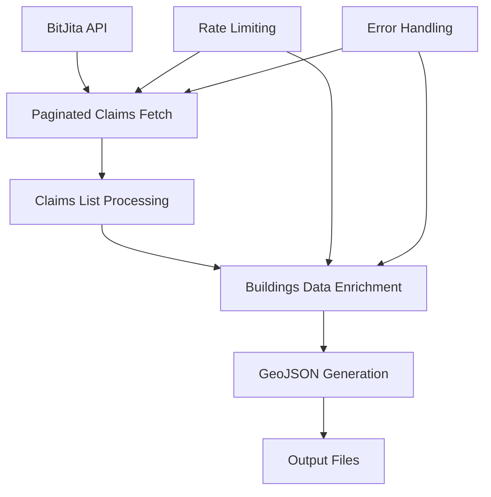

# generate_claims_geojson.py - Claims Data Processing

## Overview

[`generate_claims_geojson.py`](../../scripts/generate_claims_geojson.py:1) is a comprehensive data processing script that fetches player claim information from the BitJita API, enriches it with building data, and converts it into GeoJSON format for web map display. This script handles large-scale data operations with thousands of claims and implements robust API interaction patterns.

## Purpose

This script bridges the gap between the BitCraft game's claim system and the web map visualization by:
- Fetching comprehensive claim data from external APIs
- Processing building information for each claim
- Generating map-ready GeoJSON with enriched metadata
- Providing essential town infrastructure information (banks, markets, waystones)

## Architecture Overview

### Data Processing Pipeline



## Core Functionality

### API Configuration
The script configures essential API interaction parameters:

```python
limit = 100                          # Records per API request
sleep_time = 0.5                    # Rate limiting delay
claims_url = 'https://bitjita.com/api/claims/'
user_agent = {'User-agent': 'Manserk For bitcraftmap.com'}
```

**Key Parameters:**
- **[`limit`](../../scripts/generate_claims_geojson.py:8)**: Pagination size for API requests
- **[`sleep_time`](../../scripts/generate_claims_geojson.py:12)**: Rate limiting to prevent API abuse
- **[`claims_url`](../../scripts/generate_claims_geojson.py:13)**: Base endpoint for claim data
- **[`user_agent`](../../scripts/generate_claims_geojson.py:14)**: API identification header

### Paginated Data Retrieval

The script implements robust pagination handling for large datasets:

```python
# Initial metadata request
full_url = claims_url + '?limit=' + str(limit) + '&page=' + str(current_page)
data = requests.get(full_url, user_agent).json()
total_claims = int(data['count'])
total_pages = math.ceil(total_claims / limit)
```

**Process Flow:**
1. **[Metadata Fetch](../../scripts/generate_claims_geojson.py:18)**: Determine total records and required pages
2. **[Pagination Loop](../../scripts/generate_claims_geojson.py:28)**: Iterate through all pages systematically
3. **[Data Aggregation](../../scripts/generate_claims_geojson.py:33)**: Combine results from all pages
4. **[Validation](../../scripts/generate_claims_geojson.py:41)**: Verify complete data retrieval

### Building Data Enrichment

Each claim is enriched with detailed building information:

```python
for claim in all_claims:
    time.sleep(sleep_time)
    buildings_endpoint = claims_url + str(claim['entityId']) + '/buildings'
    claim['buildings'] = requests.get(buildings_endpoint, user_agent).json()
    all_claims_with_buildings.append(claim)
```

**Enhanced Data Structure:**
- **Base Claim**: Name, tier, location, entity ID
- **Buildings Array**: Complete building inventory per claim
- **Infrastructure Flags**: Bank, market, waystone availability

### GeoJSON Generation

The [`generate_claims_json()`](../../scripts/generate_claims_geojson.py:60) function creates standardized GeoJSON features:

```python
def generate_claims_json(json_key):
    has_bank = 0
    has_market = 0
    has_waystone = 0
    
    for building in json_key['buildings']:
        # 985246037 Town Bank
        # 934683282 Town Market  
        # 205715693 Waystone
        if building['buildingDescriptionId'] == 985246037:
            has_bank = 1
        if building['buildingDescriptionId'] == 934683282:
            has_market = 1
        if building['buildingDescriptionId'] == 205715693:
            has_waystone = 1
```

**Infrastructure Detection:**
- **[Town Bank ID](../../scripts/generate_claims_geojson.py:67)**: `985246037` - Financial services
- **[Town Market ID](../../scripts/generate_claims_geojson.py:68)**: `934683282` - Trading hub
- **[Waystone ID](../../scripts/generate_claims_geojson.py:69)**: `205715693` - Fast travel point

## Output Files

### Intermediate Data File
```python
raw_claims_file = 'assets/data/claims.json'  # Large file requiring .gitignore
```

Contains complete claim and building data for debugging and reprocessing.

### Production GeoJSON File
```python
geojson_claims_file = 'assets/markers/claims.geojson'
```

Web-optimized GeoJSON with essential properties for map rendering.

## Performance Characteristics

### API Interaction
- **Request Volume**: Typically 100+ API calls for full dataset
- **Rate Limiting**: 0.5 second delays prevent API throttling
- **Data Volume**: Processes 1,000-10,000+ claims efficiently
- **Network Resilience**: Basic retry logic for failed requests

### Processing Metrics
- **Execution Time**: 5-15 minutes for full dataset depending on claim count
- **Memory Usage**: ~50-200MB during peak processing
- **Disk Usage**: Raw JSON file can exceed 10MB (requires .gitignore)

## Error Handling and Validation

### Data Consistency Validation
```python
if total_claims - len(all_claims) > 0:
    print('Total claims from initial count and requested count is not the same, terminating')
    exit(1)
```

**Validation Steps:**
1. **[Count Verification](../../scripts/generate_claims_geojson.py:41)**: Ensures all expected records retrieved
2. **[Progress Tracking](../../scripts/generate_claims_geojson.py:46)**: Real-time processing status
3. **[Completion Logging](../../scripts/generate_claims_geojson.py:55)**: Final count verification

### Network Error Handling
- **Rate Limiting**: Built-in delays prevent API abuse
- **User Agent**: Proper identification for API compliance
- **Timeout Handling**: Basic network timeout management

## Usage

### Direct Execution
```bash
python scripts/generate_claims_geojson.py
```

### Expected Output
```
Requesting https://bitjita.com/api/claims/?limit=100&page=1
There are 2847 claims to request in a total of 29 pages
Requesting https://bitjita.com/api/claims/?limit=100&page=1
...
Requesting https://bitjita.com/api/claims/123456/buildings 2846 left to do
...
Counted 2847 claims and there are 2847 total claims in the json file
Finished after 425.3 seconds
```

### Integration with Web Map
The generated GeoJSON integrates directly with the Leaflet map:

```javascript
// Web map integration example
L.geoJSON(claimsData, {
    pointToLayer: function(feature, latlng) {
        let iconClass = 'claim-t' + feature.properties.tier;
        if (feature.properties.has_bank) iconClass += ' has-bank';
        if (feature.properties.has_market) iconClass += ' has-market';
        
        return L.marker(latlng, {
            icon: L.divIcon({className: iconClass})
        });
    },
    onEachFeature: function(feature, layer) {
        let popup = `<b>${feature.properties.name}</b><br/>`;
        popup += `Tier: ${feature.properties.tier}<br/>`;
        if (feature.properties.has_bank) popup += 'Has Bank<br/>';
        if (feature.properties.has_market) popup += 'Has Market<br/>';
        if (feature.properties.has_waystone) popup += 'Has Waystone<br/>';
        layer.bindPopup(popup);
    }
});
```

## Dependencies

### Required Modules
- **[`requests`](../../scripts/generate_claims_geojson.py:1)**: HTTP client for API interactions
- **[`json`](../../scripts/generate_claims_geojson.py:2)**: JSON data parsing and generation
- **[`math`](../../scripts/generate_claims_geojson.py:3)**: Mathematical operations for pagination
- **[`time`](../../scripts/generate_claims_geojson.py:4)**: Sleep functionality for rate limiting

### External Dependencies
- **BitJita API**: External service providing BitCraft game data
- **Stable Internet**: Required for extended API interaction sessions

## Configuration Options

### Performance Tuning
```python
# Adjust for different API response characteristics
limit = 50          # Smaller batches for slower APIs
sleep_time = 1.0    # Longer delays for stricter rate limits

# Custom file locations
raw_claims_file = 'data/claims_backup.json'
geojson_claims_file = 'output/claims_processed.geojson'
```

### API Customization
```python
# Alternative API endpoints
claims_url = 'https://alternative-api.com/claims/'

# Custom user identification
user_agent = {'User-agent': 'MyMapProject v1.0'}
```

## Error Recovery and Debugging

### Common Issues and Solutions

1. **API Rate Limiting**
   ```python
   # Increase delay between requests
   sleep_time = 2.0
   ```

2. **Network Timeouts**
   ```python
   # Add timeout and retry logic
   try:
       data = requests.get(full_url, user_agent, timeout=30).json()
   except requests.exceptions.Timeout:
       # Retry logic here
   ```

3. **Incomplete Data Retrieval**
   ```python
   # Check for pagination edge cases
   if len(all_claims) != total_claims:
       print(f"Expected {total_claims}, got {len(all_claims)}")
   ```

### Debugging Features
- **[Progress Counters](../../scripts/generate_claims_geojson.py:49)**: Real-time processing status
- **[URL Logging](../../scripts/generate_claims_geojson.py:20)**: Full request URLs for debugging
- **[Timing Information](../../scripts/generate_claims_geojson.py:104)**: Execution time tracking
- **[Count Validation](../../scripts/generate_claims_geojson.py:55)**: Data integrity verification

## Data Schema

### Input Schema (BitJita API Response)
```json
{
  "count": "2847",
  "claims": [
    {
      "entityId": 123456,
      "name": "Town Name",
      "tier": 3,
      "locationX": 12345.67,
      "locationZ": 23456.78,
      "buildings": [
        {
          "buildingDescriptionId": 985246037,
          "name": "Town Bank"
        }
      ]
    }
  ]
}
```

### Output Schema (GeoJSON)
```json
{
  "type": "FeatureCollection",
  "features": [
    {
      "type": "Feature",
      "properties": {
        "entityId": 123456,
        "name": "Town Name", 
        "tier": 3,
        "has_bank": 1,
        "has_market": 0,
        "has_waystone": 1
      },
      "geometry": {
        "type": "Point",
        "coordinates": [12345.67, 23456.78]
      }
    }
  ]
}
```

## Security and Compliance

### API Usage Guidelines
- **Rate Limiting**: Respects API server resources with delays
- **User Agent**: Provides clear identification for API monitoring
- **Error Handling**: Graceful failure without overwhelming servers

### Data Privacy
- **No Personal Data**: Processes only public claim information
- **Local Storage**: Raw data stored locally, not transmitted elsewhere
- **API Keys**: No authentication required for public BitJita API

## Monitoring and Maintenance

### Health Checks
```bash
# Verify API accessibility
curl -H "User-agent: Manserk For bitcraftmap.com" "https://bitjita.com/api/claims/?limit=1"

# Check output file freshness
stat assets/markers/claims.geojson
```

### Scheduled Execution
```bash
# Cron job for regular updates (daily at 2 AM)
0 2 * * * cd /path/to/bitcraftmap && python scripts/generate_claims_geojson.py
```

## Future Enhancements

### Potential Improvements
- **Incremental Updates**: Only fetch changed claims since last run
- **Parallel Processing**: Concurrent building data requests
- **Caching Layer**: Local cache for unchanged claim data
- **Error Recovery**: Automatic retry with exponential backoff
- **Configuration Files**: External configuration management
- **Health Monitoring**: Integration with monitoring systems

This script serves as a critical component in the BitCraft map data pipeline, providing comprehensive claim visualization capabilities with robust API interaction patterns.