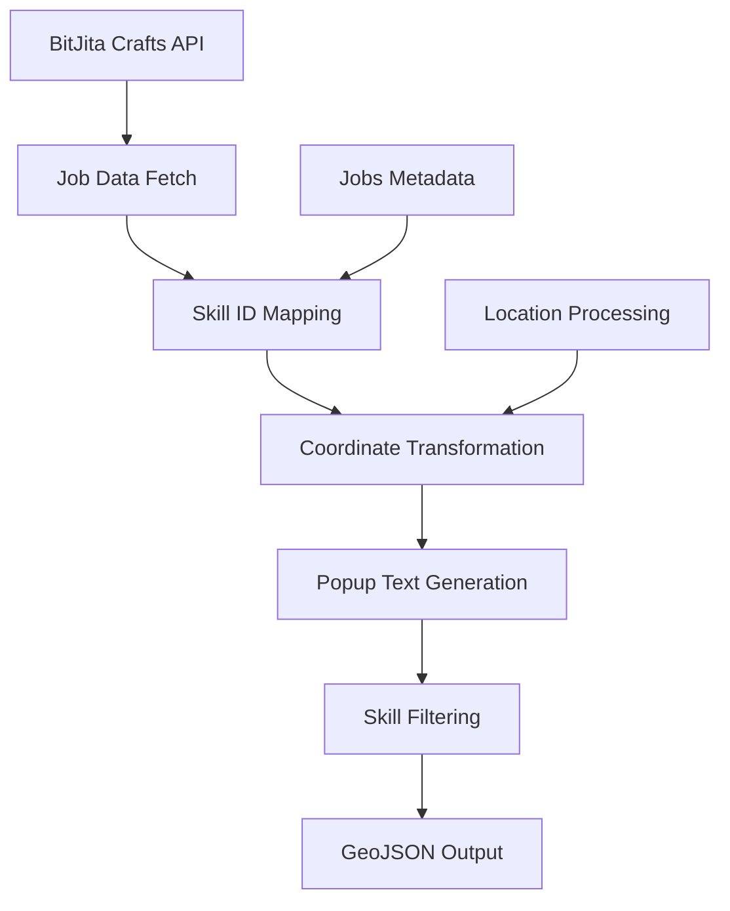

# generate_jobs_geojson.py - Jobs/Crafts Data Processing

## Overview

[`generate_jobs_geojson.py`](../../scripts/generate_jobs_geojson.py:1) is a specialized data processing script that fetches crafting job information from the BitJita API and converts it into map-ready GeoJSON format. This script focuses on displaying active crafting opportunities across the BitCraft world, complete with skill requirements and progress tracking.

## Purpose

This script bridges the gap between the BitCraft crafting system and map visualization by:
- Fetching real-time crafting job data from external APIs
- Mapping game skill IDs to human-readable profession names
- Converting job locations to map coordinates with appropriate scaling
- Generating interactive popups with comprehensive job information
- Filtering jobs by specific skill categories for targeted displays

## Architecture Overview

### Data Flow Pipeline



## Core Functionality

### API Configuration
The script configures essential API interaction parameters:

```python
jobs_url = 'https://bitjita.com/api/crafts'
user_agent = {'User-agent': 'Java'}
geojson_file = 'jobs.geojson'
```

**Configuration Parameters:**
- **[`jobs_url`](../../scripts/generate_jobs_geojson.py:7)**: BitJita crafts API endpoint
- **[`user_agent`](../../scripts/generate_jobs_geojson.py:8)**: API identification header
- **[`geojson_file`](../../scripts/generate_jobs_geojson.py:9)**: Output file location

### Profession Skill Mapping
The script maintains a comprehensive mapping of game skill IDs to profession metadata:

```python
jobs_metadata = [
    {"Name": "Any", "IconName": "Any"},        # Index 0, 1
    {"Name": "Forestry", "IconName": "iconForestry"},     # Index 2
    {"Name": "Carpentry", "IconName": "iconCarpentry"},   # Index 3
    {"Name": "Masonry", "IconName": "iconMasonry"},       # Index 4
    {"Name": "Mining", "IconName": "iconMining"},         # Index 5
    # ... additional professions
]
```

**Profession Categories:**
- **[Forestry](../../scripts/generate_jobs_geojson.py:14)** (ID: 2): Tree harvesting and wood processing
- **[Carpentry](../../scripts/generate_jobs_geojson.py:15)** (ID: 3): Woodworking and construction  
- **[Masonry](../../scripts/generate_jobs_geojson.py:16)** (ID: 4): Stone working and building
- **[Mining](../../scripts/generate_jobs_geojson.py:17)** (ID: 5): Ore extraction and processing
- **[Smithing](../../scripts/generate_jobs_geojson.py:18)** (ID: 6): Metal working and tool creation
- **[Additional Skills](../../scripts/generate_jobs_geojson.py:19)**: Scholar, Leatherworking, Hunting, etc.

### Coordinate Transformation System
The script implements coordinate scaling for map display:

```python
n_coord = round(json_key['claimLocationZ'] / 3)
e_coord = round(json_key['claimLocationX'] / 3)
```

**Coordinate Processing:**
- **Scale Factor**: Divides world coordinates by 3 for display optimization
- **Rounding**: Ensures integer coordinates for clean display
- **North/East Convention**: Uses traditional cartographic naming (N/E)

### Job Data Processing Function
The [`generate_jobs_geojson()`](../../scripts/generate_jobs_geojson.py:32) function creates comprehensive job features:

```python
def generate_jobs_geojson(json_key):
    skill_id = json_key['levelRequirements'][0]['skill_id']
    level_requirement = json_key['levelRequirements'][0]['level']
    text_location_name = json_key['claimName']
    text_location = "N " + str(e_coord) + "E " + str(n_coord)
    text_profession = "Type: " + jobs_metadata[skill_id]['Name']
    text_effort = "Effort: " + str(json_key['progress']) + " / " + str(json_key['totalActionsRequired'])
    text_requirement = "Level : " + str(level_requirement)
```

**Generated Information:**
- **Location Name**: Claim or settlement name where job is located
- **Coordinates**: Scaled N/E coordinate display  
- **Profession Type**: Human-readable skill name
- **Progress Tracking**: Current progress vs. total required actions
- **Skill Requirements**: Minimum level needed to participate

## Data Schema and Structure

### Input Schema (BitJita API Response)
```json
{
  "craftResults": [
    {
      "entityId": 123456,
      "claimName": "Example Town",
      "claimLocationX": 12345.67,
      "claimLocationZ": 23456.78,
      "progress": 150,
      "totalActionsRequired": 500,
      "levelRequirements": [
        {
          "skill_id": 4,
          "level": 25
        }
      ]
    }
  ]
}
```

### Output Schema (GeoJSON Feature)
```json
{
  "type": "Feature",
  "id": 123456,
  "properties": {
    "popupText": [
      "Example Town",
      "N 4115E 7819", 
      "Type: Masonry",
      "Effort: 150 / 500",
      "Level : 25"
    ],
    "iconName": "iconMasonry",
    "iconSize": [30, 30],
    "turnLayerOff": ["ruinedLayer", "treesLayer", "templesLayer"]
  },
  "geometry": {
    "type": "Point",
    "coordinates": [12345.67, 23456.78]
  }
}
```

## Skill Filtering System
The script implements selective job filtering based on skill categories:

```python
jobs_geojson = {
    "type": "FeatureCollection",
    "features": [generate_jobs_geojson(job) for job in jobs_json['craftResults'] 
                if job['levelRequirements'][0]['skill_id'] == 4]
}
```

**Filtering Logic:**
- **[Masonry Focus](../../scripts/generate_jobs_geojson.py:60)**: Currently filters for skill_id == 4 (Masonry jobs)
- **Single Skill**: Processes only one profession type per execution
- **Requirement Check**: Assumes first level requirement contains primary skill

## Performance Characteristics

### API Interaction
- **Single Request**: Fetches all available crafting jobs in one API call
- **Response Size**: Typically processes 50-500 active jobs
- **Processing Time**: <5 seconds for complete job processing
- **Memory Usage**: ~5-20MB during peak processing

### Data Processing
- **Coordinate Scaling**: Mathematical operations for all job locations
- **String Generation**: Multiple text concatenations per job
- **Metadata Lookup**: O(1) skill ID to profession name mapping
- **Filtering**: Linear scan through all jobs for skill matching

## Usage Examples

### Direct Execution
```bash
python scripts/generate_jobs_geojson.py
```

### Expected Output
```
Requesting https://bitjita.com/api/crafts
Finished after 3.2 seconds
```

### Web Map Integration
```javascript
// Load and display crafting jobs
fetch('jobs.geojson')
  .then(response => response.json())
  .then(jobsData => {
    L.geoJSON(jobsData, {
      pointToLayer: function(feature, latlng) {
        return L.marker(latlng, {
          icon: L.icon({
            iconUrl: `assets/images/wiki/${feature.properties.iconName}.svg`,
            iconSize: feature.properties.iconSize
          })
        });
      },
      onEachFeature: function(feature, layer) {
        const popup = feature.properties.popupText.join('<br/>');
        layer.bindPopup(popup);
        
        // Handle layer visibility
        feature.properties.turnLayerOff.forEach(layerName => {
          if (map.hasLayer(window[layerName])) {
            map.removeLayer(window[layerName]);
          }
        });
      }
    }).addTo(map);
  });
```

## Customization Options

### Skill Filter Configuration
```python
# Filter for different professions
MINING_JOBS = 5      # Show mining opportunities
SMITHING_JOBS = 6    # Show smithing work
ALL_JOBS = None      # Show all available jobs

# Multi-skill filtering
target_skills = [4, 5, 6]  # Masonry, Mining, Smithing
filtered_jobs = [job for job in jobs_json['craftResults'] 
                if job['levelRequirements'][0]['skill_id'] in target_skills]
```

### Coordinate Display Customization
```python
# Different coordinate formats
def format_coordinates(x, z, format_type="NE"):
    scaled_x = round(x / 3)
    scaled_z = round(z / 3)
    
    if format_type == "NE":
        return f"N {scaled_z}E {scaled_x}"
    elif format_type == "XZ":
        return f"X: {scaled_x}, Z: {scaled_z}"
    elif format_type == "GRID":
        return f"Grid [{scaled_x}, {scaled_z}]"
```

### Progress Display Options
```python
# Enhanced progress formatting
def format_progress(current, total):
    percentage = round((current / total) * 100, 1)
    return f"Progress: {current}/{total} ({percentage}%)"

# Time estimation
def estimate_completion(current, total, rate_per_hour):
    remaining = total - current
    hours_left = remaining / rate_per_hour
    return f"Est. {hours_left:.1f}h remaining"
```

## Error Handling and Validation

### API Error Management
```python
try:
    jobs_json = requests.get(jobs_url, user_agent, timeout=30).json()
except requests.exceptions.Timeout:
    print("API request timed out")
    exit(1)
except requests.exceptions.RequestException as e:
    print(f"API request failed: {e}")
    exit(1)
```

### Data Validation
```python
def validate_job_data(job):
    """Validate job data completeness"""
    required_fields = ['entityId', 'claimName', 'claimLocationX', 'claimLocationZ', 
                      'progress', 'totalActionsRequired', 'levelRequirements']
    
    for field in required_fields:
        if field not in job:
            raise ValueError(f"Missing required field: {field}")
    
    if not job['levelRequirements']:
        raise ValueError("No level requirements specified")
    
    return True
```

## Integration Patterns

### Multi-Skill Processing
```python
def generate_all_profession_maps():
    """Generate separate GeoJSON files for each profession"""
    base_jobs = requests.get(jobs_url, user_agent).json()
    
    professions = {
        'forestry': 2,
        'carpentry': 3, 
        'masonry': 4,
        'mining': 5,
        'smithing': 6
    }
    
    for name, skill_id in professions.items():
        filtered_jobs = [job for job in base_jobs['craftResults']
                        if job['levelRequirements'][0]['skill_id'] == skill_id]
        
        output_file = f'jobs_{name}.geojson'
        with open(output_file, 'w') as f:
            json.dump({
                "type": "FeatureCollection",
                "features": [generate_jobs_geojson(job) for job in filtered_jobs]
            }, f)
```

### Scheduling and Automation
```bash
# Cron job for regular job updates (every 30 minutes)
*/30 * * * * cd /path/to/bitcraftmap && python scripts/generate_jobs_geojson.py

# Integration with map refresh
0 * * * * cd /path/to/bitcraftmap && python scripts/generate_jobs_geojson.py && systemctl reload nginx
```

## Advanced Features

### Dynamic Skill Selection
```python
import argparse

parser = argparse.ArgumentParser(description='Generate jobs GeoJSON for specific skills')
parser.add_argument('--skill', type=int, help='Skill ID to filter (4=Masonry, 5=Mining, etc.)')
parser.add_argument('--all', action='store_true', help='Include all skills')
args = parser.parse_args()

# Use command line arguments for filtering
if args.all:
    filtered_jobs = jobs_json['craftResults']
elif args.skill:
    filtered_jobs = [job for job in jobs_json['craftResults']
                    if job['levelRequirements'][0]['skill_id'] == args.skill]
```

### Enhanced Popup Information
```python
def generate_enhanced_popup(job_data):
    """Create rich popup content with additional information"""
    popup_lines = [
        job_data['claimName'],
        f"N {e_coord}E {n_coord}",
        f"Type: {jobs_metadata[skill_id]['Name']}",
        f"Progress: {job_data['progress']}/{job_data['totalActionsRequired']}",
        f"Level Required: {level_requirement}",
        f"Completion: {(job_data['progress']/job_data['totalActionsRequired']*100):.1f}%"
    ]
    
    # Add estimated completion time if data available
    if 'estimatedHours' in job_data:
        popup_lines.append(f"Est. Time: {job_data['estimatedHours']}h")
    
    return popup_lines
```

## Monitoring and Analytics

### Job Tracking Metrics
```python
def analyze_job_distribution(jobs_data):
    """Analyze job distribution across skills and locations"""
    skill_counts = {}
    location_counts = {}
    
    for job in jobs_data['craftResults']:
        skill_id = job['levelRequirements'][0]['skill_id']
        skill_name = jobs_metadata[skill_id]['Name']
        
        skill_counts[skill_name] = skill_counts.get(skill_name, 0) + 1
        location_counts[job['claimName']] = location_counts.get(job['claimName'], 0) + 1
    
    print("Job Distribution by Skill:")
    for skill, count in sorted(skill_counts.items()):
        print(f"  {skill}: {count}")
```

### Health Monitoring
```python
def monitor_job_api_health():
    """Monitor API availability and response times"""
    start_time = time.time()
    try:
        response = requests.get(jobs_url, user_agent, timeout=10)
        response_time = time.time() - start_time
        
        if response.status_code == 200:
            data = response.json()
            job_count = len(data.get('craftResults', []))
            print(f"API healthy: {job_count} jobs, {response_time:.2f}s response time")
        else:
            print(f"API returned status {response.status_code}")
    except Exception as e:
        print(f"API health check failed: {e}")
```

## Future Enhancements

### Potential Improvements
- **Multi-Skill Maps**: Generate separate overlays for each profession
- **Progress Tracking**: Historical progress tracking for long-term jobs
- **Skill Level Filtering**: Show only jobs matching player skill levels
- **Reward Information**: Include crafting rewards and resource requirements
- **Real-time Updates**: WebSocket integration for live job status
- **Player Matching**: Match jobs to player skill levels and preferences

### Advanced Data Processing
```python
def enhanced_job_processing():
    """Advanced job data processing with additional features"""
    # Resource requirement analysis
    # Skill level recommendations
    # Economic value calculations
    # Player proximity analysis
    # Job completion predictions
```

This script provides essential crafting job visualization for the BitCraft map, enabling players to discover and track crafting opportunities across the game world with detailed skill and progress information.