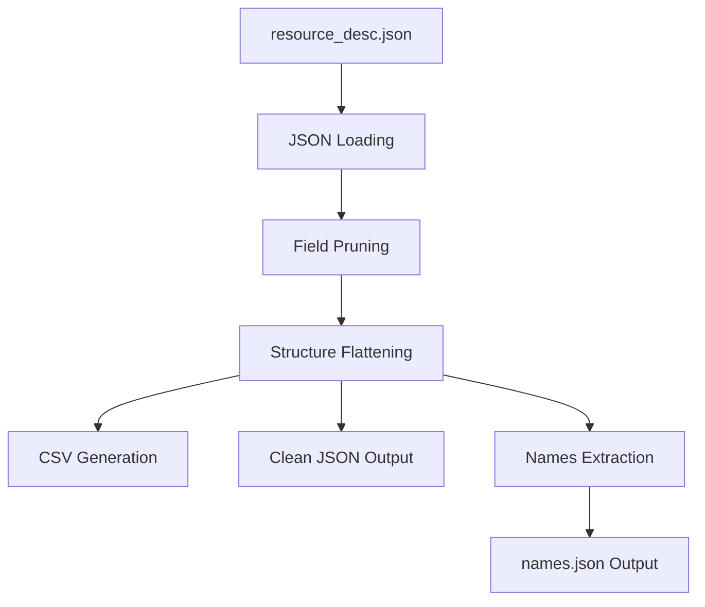

# generate_resource_csv_desc.py - Resource Data Processing

## Overview

[`generate_resource_csv_desc.py`](../../scripts/generate_resource_csv_desc.py:1) is an advanced data transformation utility designed to process BitCraft resource description files. It performs sophisticated data cleaning, structure flattening, and multi-format export operations to convert complex nested game data into analysis-ready formats.

## Purpose

This script addresses the complexity of BitCraft's resource data system by:
- Removing development-specific and unnecessary fields from resource data
- Flattening complex nested JSON structures for tabular analysis
- Generating both CSV and JSON outputs for different use cases
- Creating separate name mapping files for efficient lookups
- Supporting configurable field filtering for different analysis needs

## Architecture Overview

### Data Processing Pipeline



## Core Functionality

### Configuration Parameters
The script uses extensive configuration for flexible operation:

```python
INPUT_PATH      = Path("resource_desc.json")
OUTPUT_PATH     = Path("resource_desc.csv") 
NAMES_JSON_PATH = Path("names.json")
DROP_KEYS = [/* extensive list of fields to remove */]
DROP_RECURSIVE = True    # Remove keys at any nesting depth
ENCODING = "utf-8"
```

**File Path Configuration:**
- **[`INPUT_PATH`](../../scripts/generate_resource_csv_desc.py:6)**: Source JSON file with resource descriptions
- **[`OUTPUT_PATH`](../../scripts/generate_resource_csv_desc.py:7)**: Generated CSV file location
- **[`NAMES_JSON_PATH`](../../scripts/generate_resource_csv_desc.py:8)**: ID-to-name mapping file

### Comprehensive Field Filtering
The script removes extensive game development and internal fields:

```python
DROP_KEYS = [
    "description",           # Verbose text descriptions
    "flattenable",          # Game engine properties
    "max_health",           # Gameplay balance data
    "ignore_damage",        # Combat system flags
    "despawn_time",         # Lifecycle management
    "model_asset_name",     # Unity asset references
    "icon_asset_name",      # UI asset references  
    "on_destroy_yield",     # Resource generation rules
    "spawn_priority",       # World generation parameters
    "footprint",            # Collision detection data
    "rarity",              # Drop rate information
    "compendium_entry",    # Documentation references
    "enemy_params_id",     # Combat integration
    "scheduled_respawn_time", # Respawn mechanics
    "not_respawning"       # State management
]
```

**Filtered Categories:**
- **Game Balance**: Health, damage, rarity, respawn mechanics
- **Asset References**: Model and icon file paths  
- **Engine Integration**: Unity-specific properties and IDs
- **Documentation**: Descriptions and help text
- **Development Data**: Debug flags and internal parameters

### Advanced Data Pruning
The [`prune()`](../../scripts/generate_resource_csv_desc.py:32) function implements recursive field removal:

```python
def prune(obj, keys, recursive=True):
    if isinstance(obj, list):
        return [prune(x, keys, recursive) for x in obj]
    if isinstance(obj, dict):
        if recursive:
            return {k: prune(v, keys, recursive) for k, v in obj.items() if k not in keys}
        for k in keys:
            obj.pop(k, None)
        return obj
    return obj
```

**Pruning Features:**
- **Deep Recursion**: Removes keys at any nesting level when `recursive=True`
- **Type Preservation**: Maintains data structure integrity during processing
- **Flexible Modes**: Supports both recursive and shallow key removal
- **Memory Efficiency**: Processes data structures without duplication

### Structure Flattening System
The [`flatten()`](../../scripts/generate_resource_csv_desc.py:43) function converts nested objects to flat key-value pairs:

```python
def flatten(obj, prefix=""):
    out = {}
    if isinstance(obj, dict):
        for k, v in obj.items():
            nk = f"{prefix}.{k}" if prefix else k
            if isinstance(v, dict):
                out.update(flatten(v, nk))  # Recursive flattening
            elif isinstance(v, list):
                out[nk] = json.dumps(v, ensure_ascii=False)  # Serialize arrays
            else:
                out[nk] = v  # Direct value assignment
    else:
        out[prefix or "value"] = obj
    return out
```

**Flattening Logic:**
- **Nested Objects**: Converts `{"a": {"b": "c"}}` to `{"a.b": "c"}`
- **Array Serialization**: Lists become JSON strings for CSV compatibility
- **Primitive Values**: Maintains original types for simple data
- **Prefix Management**: Builds hierarchical key names with dot notation

### CSV Export Framework
The script implements sophisticated CSV generation with dynamic schema detection:

```python
def to_rows(data):
    if isinstance(data, list):
        return [x if isinstance(x, dict) else {"value": x} for x in data]
    return [data if isinstance(data, dict) else {"value": data}]

def headers(rows):
    ks = set()
    for r in rows:
        ks.update(r.keys())
    return sorted(ks)
```

**CSV Generation Process:**
1. **[Data Normalization](../../scripts/generate_resource_csv_desc.py:58)**: Converts various data structures to row format
2. **[Header Detection](../../scripts/generate_resource_csv_desc.py:63)**: Dynamically discovers all possible columns
3. **[Schema Generation](../../scripts/generate_resource_csv_desc.py:67)**: Creates sorted column headers for consistency
4. **[Row Writing](../../scripts/generate_resource_csv_desc.py:77)**: Outputs rows with proper null value handling

## Main Processing Function

### Execution Flow
The [`main()`](../../scripts/generate_resource_csv_desc.py:69) function orchestrates the complete processing pipeline:

```python
def main():
    data = json.loads(INPUT_PATH.read_text(ENCODING))      # Load source data
    data = prune(data, DROP_KEYS, DROP_RECURSIVE)          # Remove unwanted fields
    rows = [flatten(r) for r in to_rows(data)]             # Flatten structures
    cols = headers(rows)                                   # Generate schema
    
    # CSV output generation
    with OUTPUT_PATH.open("w", newline="", encoding=ENCODING) as f:
        w = csv.DictWriter(f, fieldnames=cols, extrasaction="ignore")
        w.writeheader()
        for r in rows:
            w.writerow({k: r.get(k, "") for k in cols})
    
    # Names mapping generation
    base_rows = to_rows(data)
    names = [{"id": r.get("id"), "name": r.get("name")} for r in base_rows if isinstance(r, dict)]
    NAMES_JSON_PATH.write_text(json.dumps(names, ensure_ascii=False, separators=(',', ':')), ENCODING)
```

## Data Processing Examples

### Input Data Structure
```json
{
  "resource_001": {
    "id": "resource_001",
    "name": "Iron Ore",
    "description": "A common metallic ore...",
    "max_health": 100,
    "properties": {
      "hardness": 5,
      "density": 7.8
    },
    "spawn_rules": {
      "rarity": 0.3,
      "biomes": ["mountain", "cave"]
    }
  }
}
```

### After Pruning (Removes description, max_health, rarity)
```json
{
  "resource_001": {
    "id": "resource_001", 
    "name": "Iron Ore",
    "properties": {
      "hardness": 5,
      "density": 7.8
    },
    "spawn_rules": {
      "biomes": ["mountain", "cave"]
    }
  }
}
```

### After Flattening
```csv
key,id,name,properties.hardness,properties.density,spawn_rules.biomes
resource_001,resource_001,Iron Ore,5,7.8,"[""mountain"", ""cave""]"
```

### Generated Names File
```json
[{"id": "resource_001", "name": "Iron Ore"}]
```

## Performance Characteristics

### Processing Efficiency
- **Memory Usage**: Processes entire dataset in memory (suitable for <500MB files)
- **Processing Speed**: ~500-1000 objects per second depending on complexity
- **I/O Operations**: Minimal - single read/write operations per file

### Output Optimization
- **CSV Formatting**: UTF-8 encoding with proper escaping for international characters
- **JSON Minification**: Names file uses compact format without whitespace
- **Field Ordering**: Consistent alphabetical column ordering for reproducible outputs

## Usage Examples

### Direct Execution
```bash
python scripts/generate_resource_csv_desc.py
```

### Custom Configuration
```python
# Modify configuration for different input files
INPUT_PATH = Path("custom_resources.json")
OUTPUT_PATH = Path("custom_output.csv")

# Custom field filtering
CUSTOM_DROP_KEYS = ["debug_info", "internal_id", "temp_data"]

# Run with custom settings
python generate_resource_csv_desc.py
```

### Integration Example
```python
import json
from pathlib import Path
from generate_resource_csv_desc import prune, flatten, to_rows

# Process custom data source
data = json.loads(Path("game_data.json").read_text())
cleaned = prune(data, ["debug", "internal"], recursive=True)
rows = [flatten(item) for item in to_rows(cleaned)]

# Generate analysis-ready dataset
with open("analysis_data.csv", "w") as f:
    writer = csv.DictWriter(f, fieldnames=headers(rows))
    writer.writeheader()
    writer.writerows(rows)
```

## Dependencies

### Required Modules
- **[`json`](../../scripts/generate_resource_csv_desc.py:2)**: JSON parsing and serialization
- **[`csv`](../../scripts/generate_resource_csv_desc.py:2)**: CSV file generation with proper formatting
- **[`pathlib.Path`](../../scripts/generate_resource_csv_desc.py:3)**: Modern file path handling

### No External Dependencies
Uses only Python standard library for maximum compatibility and reliability.

## Error Handling and Validation

### File System Error Management
```python
# Enhanced error handling
def main():
    try:
        if not INPUT_PATH.exists():
            raise FileNotFoundError(f"Input file not found: {INPUT_PATH}")
        
        data = json.loads(INPUT_PATH.read_text(ENCODING))
        
        if not data:
            raise ValueError("Input file contains no data")
            
    except json.JSONDecodeError as e:
        print(f"Invalid JSON in input file: {e}")
        return 1
    except Exception as e:
        print(f"Processing error: {e}")
        return 1
```

### Data Validation
```python
def validate_resource_data(data):
    """Validate resource data structure and content"""
    if not isinstance(data, (dict, list)):
        raise TypeError("Data must be dict or list")
    
    # Validate required fields
    required_fields = ["id", "name"]
    for item in to_rows(data):
        for field in required_fields:
            if field not in item:
                print(f"Warning: Missing required field '{field}' in item")
```

## Advanced Customization

### Dynamic Field Selection
```python
# Context-aware field filtering
def get_analysis_fields(analysis_type):
    """Return appropriate fields for different analysis types"""
    field_sets = {
        'economic': ['id', 'name', 'value', 'rarity', 'trade_volume'],
        'gameplay': ['id', 'name', 'max_health', 'spawn_rules', 'yield'],
        'technical': ['id', 'name', 'model_asset_name', 'collision_data']
    }
    return field_sets.get(analysis_type, ['id', 'name'])

# Usage
ANALYSIS_TYPE = 'economic'
KEEP_FIELDS = get_analysis_fields(ANALYSIS_TYPE)
DROP_KEYS = [key for key in ALL_POSSIBLE_KEYS if key not in KEEP_FIELDS]
```

### Multi-Format Export
```python
def export_multiple_formats(data, base_name):
    """Export data in multiple formats for different tools"""
    
    # CSV for spreadsheet analysis
    export_csv(data, f"{base_name}.csv")
    
    # JSON for programmatic access
    export_json(data, f"{base_name}.json")
    
    # TSV for specialized tools
    export_tsv(data, f"{base_name}.tsv")
    
    # Parquet for big data analysis
    export_parquet(data, f"{base_name}.parquet")
```

### Conditional Processing
```python
# Size-aware processing for large datasets
def process_large_dataset(input_path):
    """Handle large datasets with streaming or chunking"""
    file_size = input_path.stat().st_size
    
    if file_size > 100_000_000:  # 100MB threshold
        return process_streaming(input_path)
    else:
        return process_in_memory(input_path)
```

## Integration Patterns

### Data Pipeline Integration
```python
def resource_processing_pipeline():
    """Complete resource data processing workflow"""
    
    # Step 1: Raw data cleaning
    generate_resource_csv_desc.main()
    
    # Step 2: Data validation
    validate_output_files()
    
    # Step 3: Index generation
    generate_search_indices()
    
    # Step 4: Cache invalidation
    invalidate_analysis_cache()
```

### Analysis Workflow
```bash
#!/bin/bash
# Complete analysis workflow
echo "Processing resource data..."
python scripts/generate_resource_csv_desc.py

echo "Generating analysis reports..."
python analysis/resource_analysis.py resource_desc.csv

echo "Creating visualizations..."
python visualization/resource_charts.py resource_desc.csv
```

## Quality Assurance

### Output Validation
```python
def validate_output_consistency():
    """Ensure CSV and JSON outputs are consistent"""
    
    # Load CSV data
    csv_data = []
    with open(OUTPUT_PATH, 'r', encoding=ENCODING) as f:
        csv_data = list(csv.DictReader(f))
    
    # Load names data
    names_data = json.loads(NAMES_JSON_PATH.read_text(ENCODING))
    
    # Validate record counts match
    assert len(csv_data) == len(names_data), "Record count mismatch"
    
    # Validate ID consistency
    csv_ids = {row.get('id') for row in csv_data}
    names_ids = {item.get('id') for item in names_data}
    assert csv_ids == names_ids, "ID sets don't match"
```

### Data Integrity Checks
```python
def check_data_integrity(before_data, after_data):
    """Verify data integrity after processing"""
    
    # Count preservation (allowing for filtering)
    essential_records = count_essential_records(before_data)
    output_records = len(after_data)
    
    if output_records < essential_records * 0.9:  # 90% threshold
        raise ValueError("Too many records lost during processing")
    
    # Required field presence
    for record in after_data:
        if not record.get('id') or not record.get('name'):
            raise ValueError("Essential fields missing after processing")
```

## Monitoring and Maintenance

### Performance Monitoring
```python
import time
import psutil

def monitor_processing():
    """Monitor resource usage during processing"""
    start_time = time.time()
    start_memory = psutil.Process().memory_info().rss
    
    # Run main processing
    main()
    
    end_time = time.time()
    end_memory = psutil.Process().memory_info().rss
    
    print(f"Processing time: {end_time - start_time:.2f}s")
    print(f"Memory delta: {(end_memory - start_memory) / 1024 / 1024:.1f}MB")
```

### Health Checks
```bash
# Validate output files
if [ ! -f "resource_desc.csv" ]; then
    echo "Error: CSV output missing"
    exit 1
fi

if [ ! -f "names.json" ]; then
    echo "Error: Names file missing" 
    exit 1
fi

# Check file sizes are reasonable
CSV_SIZE=$(stat -c%s resource_desc.csv)
if [ $CSV_SIZE -lt 1000 ]; then
    echo "Warning: CSV file suspiciously small"
fi
```

## Future Enhancements

### Potential Improvements
- **Schema Validation**: JSON schema validation for input data
- **Incremental Processing**: Process only changed records
- **Parallel Processing**: Multi-threaded processing for large datasets
- **Compression Support**: Handle compressed input files
- **Database Export**: Direct database integration options
- **Configuration Files**: External YAML/JSON configuration
- **Progress Reporting**: Real-time progress indicators for large files

### Advanced Features
```python
# Schema evolution handling
def handle_schema_changes(old_schema, new_schema):
    """Adapt processing for schema changes"""
    # Implement field mapping and migration logic

# Data quality scoring
def calculate_data_quality_score(processed_data):
    """Assess data quality after processing"""
    # Implement completeness, consistency, and accuracy metrics
```

This script provides a robust foundation for processing complex BitCraft resource data, offering flexible field filtering and multi-format export capabilities essential for game data analysis workflows.