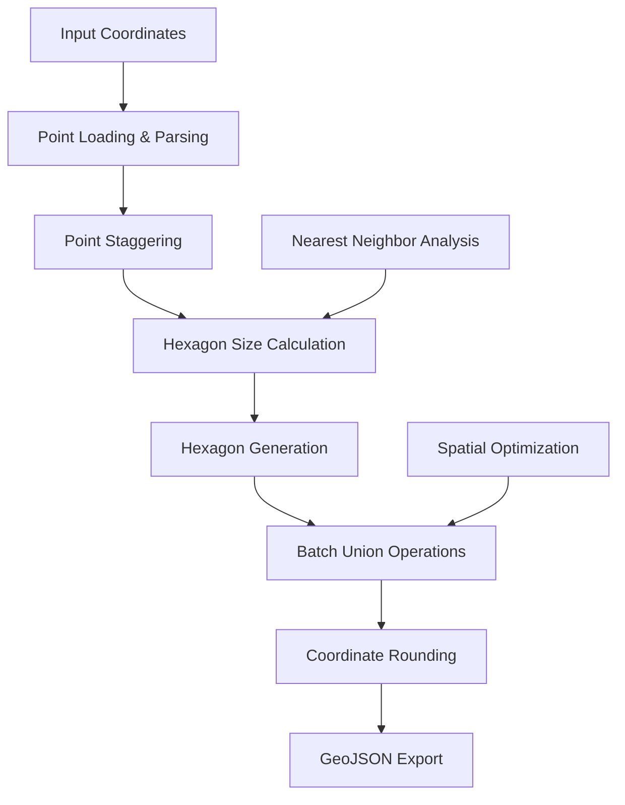

# generate_roads.py - Hexagonal Road Generation

## Overview

[`generate_roads.py`](../../scripts/generate_roads.py:1) is a sophisticated computational geometry script that generates hexagonal road networks from coordinate data points. This script creates merged hexagonal tessellations around input points and exports the results as GeoJSON MultiPolygon features, providing a visual representation of road coverage areas.

> **⚠️ Important Notice**: This script was generated by ChatGPT as noted in the [warning comments](../../scripts/generate_roads.py:3-10). While functional, it requires careful validation and testing before production use.

## Purpose

This script addresses the challenge of visualizing road networks and coverage areas by:
- Converting discrete coordinate points into hexagonal coverage zones
- Merging overlapping hexagons to create continuous road networks
- Generating web-ready GeoJSON output for map visualization
- Supporting both fixed-size and adaptive hexagon sizing
- Handling large coordinate datasets with optimized processing

## Architecture Overview

### Geometric Processing Pipeline



## Core Dependencies

### Required Libraries
```python
try:
    from shapely.geometry import Polygon, MultiPolygon
    from shapely.ops import unary_union
except ImportError:
    print("ERROR: shapely is required. Install with: pip install shapely", file=sys.stderr)
    sys.exit(1)
```

**Essential Dependencies:**
- **[Shapely](../../scripts/generate_roads.py:39)**: Computational geometry operations
- **[scipy](../../scripts/generate_roads.py:110)**: Optional KDTree acceleration for spatial queries

### Optional Performance Enhancements
```python
try:
    from scipy.spatial import cKDTree as KDTree
    # Fast spatial indexing for large datasets
except Exception:
    # Fallback to manual distance calculations
```

## Hexagonal Geometry System

### Pointy-Top Hexagon Mathematics
The script implements pointy-top hexagon generation using precise geometric calculations:

```python
def hex_vertices_pointy(center: Point, apothem: float) -> List[Point]:
    """
    Regular hexagon (pointy-top) around center with given apothem a (center→side).
    For a regular hex: side length s = 2a/√3, circumradius R = s.
    """
    a = apothem
    s = 2*a/math.sqrt(3.0)  # side length
    R = s                   # circumradius center→vertex
    x, y = center
    # angles (deg) for pointy-top: 90, 150, 210, 270, 330, 30 (CCW)
    angles = [90, 150, 210, 270, 330, 30, 90]
    verts = []
    for deg in angles:
        rad = math.radians(deg)
        verts.append((x + R*math.cos(rad), y + R*math.sin(rad)))
    return verts
```

**Geometric Properties:**
- **Apothem**: Distance from center to side (inscribed circle radius)
- **Side Length**: `s = 2a/√3` where a is apothem
- **Circumradius**: Distance from center to vertex (equals side length)
- **Orientation**: Pointy-top with vertices at 30°, 90°, 150°, 210°, 270°, 330°

### Size Calculation Strategies

#### Per-Point Adaptive Sizing
```python
def nearest_dist_per_point(points: List[Point]) -> List[float]:
    """Calculate nearest neighbor distance for each point"""
    # Try scipy KDTree for performance
    try:
        from scipy.spatial import cKDTree as KDTree
        tree = KDTree(points)
        dists, _ = tree.query(points, k=2)  # k=2 to get nearest neighbor
        return [float(d[1]) for d in dists]  # d[1] is nearest neighbor distance
    except Exception:
        # Fallback to manual calculations
```

**Adaptive Features:**
- **Nearest Neighbor Analysis**: Each hexagon sized to reach its closest neighbor
- **KDTree Acceleration**: O(log n) spatial queries for large datasets
- **Grid Optimization**: Special fast path for integer grid coordinates
- **Fallback Methods**: Manual distance calculations when scipy unavailable

#### Fixed Size Mode
```python
# Fixed apothem for all hexagons
if args.mode == "fixed":
    a = args.apothem if args.apothem is not None else 0.6
    apothems = [float(a)] * n
```

## Point Processing System

### Input Format Support
The script supports multiple input formats through flexible parsing:

```python
def load_points_from_text(txt: str) -> List[Point]:
    # Try proper JSON first
    try:
        obj = json.loads(txt)
        pts = extract_points_from_geojson(obj)
        if pts:
            return pts
    except Exception:
        pass
    # Fallback: regex for [x,y]
    pairs = re.findall(r'\[\s*(-?\d+(?:\.\d+)?)\s*,\s*(-?\d+(?:\.\d+)?)\s*\]', txt)
    pts = [(float(x), float(y)) for x,y in pairs]
    return pts
```

**Supported Formats:**
- **GeoJSON**: Complete FeatureCollection or geometry objects
- **Coordinate Arrays**: Simple `[[x,y], [x,y]]` format
- **Regex Fallback**: Extracts coordinate pairs from any text format

### Point Staggering Algorithm
The script implements a staggering system for improved hexagon tessellation:

```python
def stagger_points(points: List[Point]) -> List[Point]:
    """
    Shift every odd 'row' by +0.5 in x.
    Assumes y is integer-like (row index).
    """
    out = []
    for x, y in points:
        # If row (y) is odd
        if int(round(y)) % 2 == 1:
            out.append((x + 0.25, y))
        else:
            out.append((x - 0.25, y))
    return out
```

**Staggering Benefits:**
- **Improved Tessellation**: Creates more natural hexagonal patterns
- **Reduced Overlap**: Minimizes unnecessary polygon intersections
- **Visual Enhancement**: Produces more appealing road network patterns

## Performance Optimization

### Batch Union Processing
The script implements efficient batch processing for large polygon sets:

```python
def batch_union(polys: List[Polygon], batch: int):
    chunks = []
    total = len(polys)
    for i in range(0, total, batch):
        part = unary_union(polys[i:i+batch])
        chunks.append(part)
        print(f"Unioned batch {i//batch+1}/{math.ceil(total/batch)} (batch size {len(polys[i:i+batch])})")
    return unary_union(chunks)
```

**Optimization Features:**
- **Configurable Batch Size**: Default 5000 polygons per batch
- **Progress Reporting**: Real-time processing status
- **Memory Management**: Prevents memory exhaustion with large datasets
- **Hierarchical Processing**: Two-level union operations for efficiency

### Spatial Indexing Acceleration
```python
# Integer grid optimization for common cases
is_intish = all(abs(px - round(px)) < 1e-9 and abs(py - round(py)) < 1e-9 
               for px,py in points[:min(2000,len(points))])
if is_intish:
    # Use fast integer grid neighbor search
    S = {(int(px), int(py)) for px,py in points}
    # ... optimized neighbor finding
```

**Performance Strategies:**
- **Grid Detection**: Fast paths for integer coordinate grids
- **KDTree Acceleration**: scipy integration for spatial queries
- **Memory Optimization**: Streaming processing for very large datasets
- **Coarse Sampling**: Fallback methods for memory-constrained environments

## Command Line Interface

### Usage Patterns
```bash
# Per-point sizing (default)
python generate_roads.py input.json output.geojson

# Fixed size hexagons
python generate_roads.py input.json output.geojson --mode fixed --apothem 0.6

# Custom batch size for performance tuning
python generate_roads.py input.json output.geojson --batch 10000

# Add custom properties to output
python generate_roads.py input.json output.geojson --prop color=red --prop weight=2
```

### Argument Configuration
```python
ap = argparse.ArgumentParser(description="Pointy-top hex merge around points → rounded MultiPolygon GeoJSON")
ap.add_argument("input", help="Input file (GeoJSON or text with [x,y] pairs)")
ap.add_argument("output", help="Output GeoJSON file")
ap.add_argument("--mode", choices=["per-point","fixed"], default="per-point")
ap.add_argument("--apothem", type=float, default=None)
ap.add_argument("--batch", type=int, default=5000)
ap.add_argument("--prop", action="append", default=[], metavar="KEY=VALUE")
```

## Output Generation

### Coordinate Precision Control
The script implements precise coordinate rounding for consistent output:

```python
def round_coords_2(obj: Any) -> Any:
    """
    Convert shapely geometry to GeoJSON coords with all numbers rounded to 2 decimals.
    """
    def round_pt(pt): return [round(pt[0], 2), round(pt[1], 2)]
    def round_ring(ring): return [round_pt(p) for p in ring]
    def poly_coords(poly: Polygon):
        exterior = round_ring(list(poly.exterior.coords))
        interiors = [round_ring(list(r.coords)) for r in poly.interiors]
        return [exterior] + interiors
```

**Output Features:**
- **Precision Control**: All coordinates rounded to 2 decimal places
- **File Size Optimization**: Reduced precision decreases file size
- **Consistency**: Deterministic output for version control
- **Web Compatibility**: Appropriate precision for web map display

### GeoJSON Structure
```json
{
  "type": "FeatureCollection",
  "features": [
    {
      "type": "Feature", 
      "properties": {
        "color": "red",
        "weight": 2
      },
      "geometry": {
        "type": "MultiPolygon",
        "coordinates": [
          [
            [
              [[x1, y1], [x2, y2], [x3, y3], [x4, y4], [x5, y5], [x6, y6], [x1, y1]],
              // potential holes
            ]
          ]
        ]
      }
    }
  ]
}
```

## Integration Examples

### Road Generation Workflow
```bash
#!/bin/bash
# Complete road generation pipeline

# Fetch coordinate data from APIs
curl -o region1.json http://localhost:4001/paved
curl -o region2.json http://localhost:4002/paved

# Generate hexagonal road coverage
python generate_roads.py region1.json roads_r1.geojson --mode fixed --apothem 0.5
python generate_roads.py region2.json roads_r2.geojson --mode fixed --apothem 0.5

# Merge results if needed
# (Additional processing scripts)
```

### Web Map Integration
```javascript
// Load and display generated road networks
fetch('roads_r1.geojson')
  .then(response => response.json())
  .then(roadData => {
    L.geoJSON(roadData, {
      style: {
        color: '#FF6B35',
        weight: 2,
        opacity: 0.7,
        fillOpacity: 0.3
      }
    }).addTo(map);
  });
```

## Performance Characteristics

### Processing Metrics
- **Point Capacity**: Handles 10,000+ points efficiently
- **Memory Usage**: ~100MB for 5,000 hexagons during union operations  
- **Processing Time**: 2-10 minutes for typical road datasets (1,000-5,000 points)
- **Output Size**: GeoJSON files typically 1-50MB depending on complexity

### Optimization Guidelines
```python
# Performance tuning recommendations
SMALL_DATASET = 1000      # Use default settings
MEDIUM_DATASET = 5000     # Increase batch size to 10000
LARGE_DATASET = 20000     # Use fixed mode, batch size 20000+

if point_count > LARGE_DATASET:
    args.batch = 20000
    args.mode = "fixed" 
    args.apothem = 0.5
```

## Error Handling and Validation

### Input Validation
```python
def validate_points(points):
    """Validate point data before processing"""
    if not points:
        raise ValueError("No points found in input")
    
    for i, (x, y) in enumerate(points):
        if not (-180 <= x <= 180) or not (-90 <= y <= 90):
            print(f"Warning: Point {i} may be outside valid coordinate range")
    
    return True
```

### Geometry Validation
```python
def validate_output_geometry(multipolygon):
    """Ensure generated geometry is valid"""
    if not multipolygon.is_valid:
        print("Warning: Generated geometry contains invalid polygons")
        # Attempt to fix with buffer(0)
        fixed = multipolygon.buffer(0)
        return fixed
    return multipolygon
```

## Troubleshooting Guide

### Common Issues and Solutions

1. **Memory Exhaustion**
   ```python
   # Reduce batch size for memory-constrained environments
   python generate_roads.py input.json output.geojson --batch 1000
   ```

2. **Slow Processing**
   ```python
   # Use fixed mode for better performance
   python generate_roads.py input.json output.geojson --mode fixed --apothem 0.5
   ```

3. **Invalid Geometry Output**
   ```python
   # Add geometry validation and repair
   if not result_geometry.is_valid:
       result_geometry = result_geometry.buffer(0)
   ```

4. **Coordinate System Issues**
   ```python
   # Ensure input coordinates are in appropriate projection
   # Web Mercator (EPSG:3857) or WGS84 (EPSG:4326)
   ```

## Advanced Configuration

### Custom Hexagon Properties
```python
# Add visual styling properties
python generate_roads.py input.json output.geojson \
    --prop color="#FF6B35" \
    --prop weight=3 \
    --prop opacity=0.8 \
    --prop fillOpacity=0.4
```

### Multi-Region Processing
```python
def process_multiple_regions():
    """Process multiple coordinate files with consistent settings"""
    regions = ['region1.json', 'region2.json', 'region3.json']
    
    for i, region_file in enumerate(regions, 1):
        output_file = f'roads_r{i}.geojson'
        subprocess.run([
            'python', 'generate_roads.py',
            region_file, output_file,
            '--mode', 'fixed',
            '--apothem', '0.5',
            '--batch', '5000'
        ])
```

## Quality Assurance

### Output Validation
```python
def validate_geojson_output(file_path):
    """Validate generated GeoJSON file"""
    with open(file_path, 'r') as f:
        data = json.load(f)
    
    # Check basic structure
    assert data['type'] == 'FeatureCollection'
    assert 'features' in data
    assert len(data['features']) > 0
    
    # Validate geometry
    for feature in data['features']:
        assert feature['geometry']['type'] == 'MultiPolygon'
        coords = feature['geometry']['coordinates']
        assert isinstance(coords, list) and len(coords) > 0
```

### Performance Benchmarking
```python
def benchmark_processing():
    """Benchmark different processing configurations"""
    test_sizes = [100, 500, 1000, 5000]
    configurations = [
        {'mode': 'per-point', 'batch': 5000},
        {'mode': 'fixed', 'apothem': 0.5, 'batch': 5000},
        {'mode': 'fixed', 'apothem': 0.5, 'batch': 10000}
    ]
    
    for size in test_sizes:
        for config in configurations:
            # Generate test data and benchmark
            # Record processing times and memory usage
```

## Future Enhancements

### Potential Improvements
- **Multi-threading**: Parallel hexagon generation for large datasets
- **Streaming Processing**: Handle arbitrarily large input files
- **Custom Projections**: Support for different coordinate systems
- **Interactive Preview**: Real-time parameter adjustment tools
- **Quality Metrics**: Automated assessment of output geometry quality
- **Caching System**: Avoid reprocessing unchanged input data

### Advanced Features
```python
# Adaptive resolution based on point density
def adaptive_hexagon_sizing(points, density_threshold):
    """Adjust hexagon size based on local point density"""
    # Implementation would analyze local point density
    # and adjust hexagon sizes accordingly

# Multi-scale processing
def multi_scale_road_generation(points, zoom_levels):
    """Generate road networks at multiple scales"""
    # Different hexagon sizes for different zoom levels
```

This script provides sophisticated hexagonal tessellation capabilities for visualizing road networks and coverage areas, with extensive customization options and performance optimizations for handling large coordinate datasets.