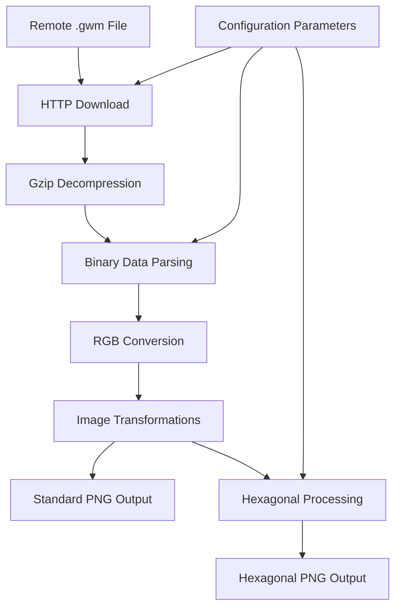

# generate_terrain_map.py - Terrain Map Processing

## Overview

[`generate_terrain_map.py`](../../scripts/generate_terrain_map.py:1) is a comprehensive image processing script that downloads, decompresses, and transforms BitCraft terrain map data into web-ready formats. It generates both standard terrain images and stylized hexagonal terrain maps suitable for game map visualization.

## Purpose

This script bridges the gap between BitCraft's proprietary terrain data format and web map requirements by:
- Downloading compressed terrain data from game servers
- Decompressing and parsing binary terrain map files
- Converting raw pixel data to standard RGB image formats
- Generating hexagonal stylized terrain maps for enhanced visual appeal
- Producing multiple output formats optimized for different use cases

## Architecture Overview

### Processing Pipeline



## Core Configuration

### Map Dimensions and Processing Parameters
The script defines comprehensive processing parameters:

```python
width = 2400          # Source image width in pixels
height = 2400         # Source image height in pixels  
pixel_size = 8        # Bytes per pixel in source data
scale_factor = 1      # Output size multiplier for normal image
header_size = 8       # Number of bytes to ignore in the file
hex_size = 6          # Hexagon radius in output pixels
scale = 10            # Output size multiplier for hex image
```

**Parameter Functions:**
- **[`width/height`](../../scripts/generate_terrain_map.py:9)**: Define the source terrain resolution (2400×2400)
- **[`pixel_size`](../../scripts/generate_terrain_map.py:11)**: Binary data format specification (8 bytes per pixel)
- **[`scale_factor`](../../scripts/generate_terrain_map.py:12)**: Scaling for standard terrain image
- **[`hex_size`](../../scripts/generate_terrain_map.py:14)**: Controls hexagon size in stylized output
- **[`scale`](../../scripts/generate_terrain_map.py:15)**: Upscaling factor for hexagonal rendering

### File Locations and URLs
```python
maps_url = 'https://maps.game.bitcraftonline.com/world-maps/'
terrain_map_file_raw = 'TerrainMap.gwm'
terrain_map_file_unzip = 'TerrainMap.gwm.unc'
terrain_map_file_png = 'TerrainMap.gwm.png'
terrain_map_file_hexagon = 'TerrainMap.hex.png'
data_folder = 'assets/data/'
```

## Data Download and Decompression

### HTTP Download Process
The script implements robust file downloading with streaming:

```python
response = requests.get(maps_url + terrain_map_file_raw, stream=True)
response.raise_for_status()

with open(data_folder + terrain_map_file_raw, "wb") as file:
    for chunk in response.iter_content(chunk_size=8192):
        if chunk:
            file.write(chunk)
```

**Download Features:**
- **Streaming Download**: Handles large files efficiently without loading into memory
- **Error Handling**: `raise_for_status()` ensures successful downloads
- **Chunked Processing**: 8KB chunks prevent memory issues
- **Automatic Directory Creation**: File operations create necessary directories

### Gzip Decompression
```python
with gzip.open(data_folder + terrain_map_file_raw, "rb") as f_in:
    with open(data_folder + terrain_map_file_unzip, "wb") as f_out:
        shutil.copyfileobj(f_in, f_out)
```

**Decompression Process:**
- **Automatic Detection**: Handles gzip-compressed terrain data
- **Memory Efficient**: Stream-based decompression using `copyfileobj`
- **Error Recovery**: Built-in error handling for corrupted archives

## Binary Data Processing

### Pixel Data Extraction and Validation
The script implements comprehensive data validation:

```python
with open(data_folder + terrain_map_file_unzip, "rb") as f:
    data = f.read()

pixel_data = data[header_size:]  # Skip 8-byte header
expected_size = width * height * pixel_size  # 2400 * 2400 * 8 = 46,080,000 bytes

if len(pixel_data) < expected_size:
    raise ValueError("File too small for expected image size.")
elif len(pixel_data) > expected_size:
    pixel_data = pixel_data[:expected_size]  # Trim padding if any
```

**Validation Features:**
- **Size Verification**: Ensures file contains expected amount of pixel data
- **Header Skipping**: Removes 8-byte file header before processing
- **Padding Handling**: Automatically trims excess data if present
- **Error Detection**: Fails gracefully if file is corrupted or incomplete

### RGB Color Conversion
The script extracts RGB values from the 8-byte pixel format:

```python
rgb_data = bytearray()
for i in range(0, len(pixel_data), pixel_size):
    b, g, r = pixel_data[i+1], pixel_data[i+2], pixel_data[i+3]  # Extract RGB from bytes 1,2,3
    rgb_data.extend([r, g, b])  # Convert BGR to RGB format
```

**Color Processing:**
- **Byte Order**: Extracts RGB from specific byte positions (1,2,3 of 8-byte pixels)
- **Color Space**: Converts from BGR to RGB for standard image formats
- **Data Type**: Builds RGB byte array for numpy image creation

## Image Transformation Pipeline

### Geometric Corrections
The script applies specific transformations to correct image orientation:

```python
img_array = np.frombuffer(rgb_data, dtype=np.uint8).reshape((height, width, 3))
img = Image.fromarray(img_array)
img = ImageOps.mirror(img)    # Horizontal flip
img = img.rotate(180)         # 180-degree rotation
img = img.resize((2400 * scale_factor, 2400 * scale_factor), resample=Image.NEAREST)
```

**Transformation Sequence:**
1. **Array Conversion**: Creates numpy array from RGB data
2. **PIL Conversion**: Converts to PIL Image for transformation operations
3. **Mirror Operation**: Horizontal flip to correct coordinate system
4. **Rotation**: 180-degree rotation for proper orientation
5. **Scaling**: Resize with nearest-neighbor interpolation to preserve pixel art style

### Standard Terrain Output
```python
img.save(data_folder + terrain_map_file_png)
```

## Hexagonal Terrain Generation

### OpenCV-Based Hexagonal Processing
The script uses OpenCV for sophisticated hexagonal tessellation:

```python
img = cv2.imread(data_folder + terrain_map_file_png)
h, w = img.shape[:2]

# Output image scaling
out_h = int(h * scale)  # 10x upscaling
out_w = int(w * scale)
result = np.zeros((out_h, out_w, 3), dtype=np.uint8)
```

### Hexagonal Grid Mathematics
```python
dx = math.sqrt(3) * hex_size    # Horizontal spacing between hexagon centers
dy = 1.5 * hex_size             # Vertical spacing between hexagon centers

for y in np.arange(0, out_h + dy, dy):
    for x in np.arange(0, out_w + dx, dx):
        offset = dx / 2 if int(y // dy) % 2 else 0  # Stagger alternating rows
        cx = x + offset
        cy = y
```

**Hexagonal Grid Properties:**
- **Horizontal Spacing**: `√3 × radius` for proper hexagon tessellation
- **Vertical Spacing**: `1.5 × radius` for optimal row separation
- **Row Staggering**: Alternating row offset creates natural hexagonal pattern
- **Pointy-Top Orientation**: Hexagons oriented with points at top/bottom

### Color Sampling and Hexagon Rendering
```python
orig_x = int(cx / scale)  # Map back to source image coordinates
orig_y = int(cy / scale)
if 0 <= orig_x < w and 0 <= orig_y < h:
    color = tuple(int(c) for c in img[orig_y, orig_x])  # Sample source color
    
    # Generate hexagon vertices
    pts = []
    for i in range(6):
        angle = math.pi / 6 + math.pi / 3 * i  # 60-degree increments starting at 30°
        px = int(cx + hex_size * math.cos(angle))
        py = int(cy + hex_size * math.sin(angle))
        pts.append([px, py])
    
    pts = np.array([pts], dtype=np.int32)
    cv2.fillPoly(result, pts, color)  # Fill hexagon with sampled color
```

**Rendering Process:**
1. **Coordinate Mapping**: Scale hexagon center coordinates to source image
2. **Color Sampling**: Extract RGB values from source terrain
3. **Vertex Calculation**: Generate 6 hexagon vertices using trigonometry
4. **Polygon Filling**: Use OpenCV to fill hexagon with sampled color

## Output Generation

### File Outputs
The script generates two distinct terrain map formats:

```python
# Standard terrain map
img.save(data_folder + terrain_map_file_png)

# Hexagonal stylized version
cv2.imwrite(data_folder + terrain_map_file_hexagon, result)
```

**Output Files:**
- **`TerrainMap.gwm.png`**: Standard 2400×2400 terrain image
- **`TerrainMap.hex.png`**: Hexagonal stylized terrain at 24000×24000 resolution

## Performance Characteristics

### Processing Metrics
- **Download Size**: ~10-50MB compressed terrain files
- **Memory Usage**: ~500MB during hexagonal processing (10x upscaling)
- **Processing Time**: 2-5 minutes for complete pipeline
- **Output Size**: Standard PNG ~5MB, Hexagonal PNG ~100MB+

### Optimization Strategies
```python
# Memory-efficient hexagon generation
CHUNK_SIZE = 1000  # Process hexagons in chunks to reduce memory usage

# Progressive output for large images
def generate_hexagons_streaming(source_img, output_size, hex_size):
    """Generate hexagons in chunks to manage memory"""
    # Implementation would process image in tiles
```

## Usage Examples

### Direct Execution
```bash
python scripts/generate_terrain_map.py
```

### Expected Output
```
Downloading terrain data...
Decompressing terrain file...  
Processing terrain image...
Generating hexagonal terrain...
Complete: Generated TerrainMap.gwm.png and TerrainMap.hex.png
```

### Integration with Web Map
```javascript
// Use terrain maps as base layers
const terrainLayer = L.tileLayer('assets/data/TerrainMap.gwm.png', {
    attribution: 'BitCraft Terrain Data',
    maxZoom: 10
});

const hexTerrainLayer = L.tileLayer('assets/data/TerrainMap.hex.png', {
    attribution: 'BitCraft Stylized Terrain',
    maxZoom: 12
});

// Layer control for switching between terrain styles
L.control.layers({
    'Standard Terrain': terrainLayer,
    'Hexagonal Terrain': hexTerrainLayer
}).addTo(map);
```

## Dependencies

### Required Modules
- **[PIL (Pillow)](../../scripts/generate_terrain_map.py:1)**: Image processing and transformations
- **[numpy](../../scripts/generate_terrain_map.py:2)**: Numerical array operations
- **[requests](../../scripts/generate_terrain_map.py:3)**: HTTP client for terrain data download
- **[gzip](../../scripts/generate_terrain_map.py:4)**: Decompression of terrain files
- **[shutil](../../scripts/generate_terrain_map.py:5)**: High-level file operations
- **[math](../../scripts/generate_terrain_map.py:6)**: Mathematical calculations for hexagon geometry
- **[cv2 (OpenCV)](../../scripts/generate_terrain_map.py:7)**: Advanced image processing and polygon rendering

### Installation Requirements
```bash
pip install Pillow numpy requests opencv-python
```

## Customization Options

### Hexagon Size and Density
```python
# Smaller hexagons for more detail
hex_size = 4
scale = 15  # Higher upscaling for small hexagons

# Larger hexagons for stylized appearance  
hex_size = 10
scale = 8   # Lower upscaling for large hexagons
```

### Color Processing Customization
```python
# Custom color extraction from 8-byte pixels
def extract_custom_colors(pixel_data):
    """Extract colors with custom processing"""
    rgb_data = bytearray()
    for i in range(0, len(pixel_data), pixel_size):
        # Custom byte interpretation
        r = pixel_data[i+3]
        g = pixel_data[i+2] 
        b = pixel_data[i+1]
        alpha = pixel_data[i+4]  # Use additional channels if needed
        
        # Apply custom color transformations
        r = int(r * 1.2)  # Brightness adjustment
        g = int(g * 0.9)  # Color balance
        b = int(b * 1.1)
        
        rgb_data.extend([r, g, b])
    return rgb_data
```

### Output Resolution Control
```python
# High-resolution output
scale_factor = 2    # 4800x4800 standard terrain
scale = 20          # 48000x48000 hexagonal terrain

# Memory-efficient output
scale_factor = 0.5  # 1200x1200 standard terrain  
scale = 5           # 12000x12000 hexagonal terrain
```

## Error Handling and Recovery

### Network Error Management
```python
def download_with_retry(url, filename, max_retries=3):
    """Download with automatic retry on failure"""
    for attempt in range(max_retries):
        try:
            response = requests.get(url, stream=True, timeout=300)
            response.raise_for_status()
            
            with open(filename, "wb") as file:
                for chunk in response.iter_content(chunk_size=8192):
                    if chunk:
                        file.write(chunk)
            return True
            
        except (requests.exceptions.RequestException, IOError) as e:
            print(f"Download attempt {attempt + 1} failed: {e}")
            if attempt < max_retries - 1:
                time.sleep(2 ** attempt)  # Exponential backoff
    return False
```

### Data Validation Enhancement
```python
def validate_terrain_data(pixel_data, expected_size):
    """Enhanced data validation with diagnostics"""
    if len(pixel_data) < expected_size:
        raise ValueError(f"File too small: {len(pixel_data)} < {expected_size}")
    
    # Check for valid RGB ranges
    for i in range(0, min(len(pixel_data), 1000), pixel_size):
        r, g, b = pixel_data[i+1], pixel_data[i+2], pixel_data[i+3]
        if not all(0 <= c <= 255 for c in [r, g, b]):
            print(f"Warning: Invalid RGB values at offset {i}: {r}, {g}, {b}")
    
    return True
```

## Advanced Features

### Multi-Format Terrain Export
```python
def export_terrain_formats(source_image):
    """Export terrain in multiple formats for different use cases"""
    
    # Web-optimized format
    source_image.save("terrain_web.webp", "WEBP", quality=85)
    
    # High-quality archive format
    source_image.save("terrain_archive.tiff", "TIFF", compression='lzw')
    
    # Tile generation for web maps
    generate_terrain_tiles(source_image, tile_size=256)
```

### Terrain Analysis Integration
```python
def analyze_terrain_colors(image_array):
    """Analyze terrain color distribution for debugging"""
    unique_colors = np.unique(image_array.reshape(-1, 3), axis=0)
    color_counts = np.bincount(image_array.reshape(-1, 3).dot([1, 256, 65536]))
    
    print(f"Unique colors: {len(unique_colors)}")
    print(f"Most common colors:")
    for i in np.argsort(color_counts)[-5:]:
        color = [i % 256, (i // 256) % 256, i // 65536]
        print(f"  RGB{color}: {color_counts[i]} pixels")
```

### Memory Optimization for Large Outputs
```python
def generate_hexagonal_terrain_chunked(source_img, output_shape, hex_size, chunk_size=2000):
    """Generate hexagonal terrain in memory-efficient chunks"""
    out_h, out_w = output_shape
    result = np.zeros((out_h, out_w, 3), dtype=np.uint8)
    
    # Process in chunks to manage memory
    for y_start in range(0, out_h, chunk_size):
        y_end = min(y_start + chunk_size, out_h)
        chunk = generate_hexagon_chunk(source_img, (y_start, 0), (y_end, out_w), hex_size)
        result[y_start:y_end, :] = chunk
        
        # Optional: Save intermediate results
        if y_start % (chunk_size * 4) == 0:
            print(f"Processed {y_start}/{out_h} rows ({100*y_start/out_h:.1f}%)")
    
    return result
```

## Quality Assurance

### Output Validation
```python
def validate_terrain_outputs():
    """Validate generated terrain files"""
    standard_path = f"{data_folder}TerrainMap.gwm.png"
    hex_path = f"{data_folder}TerrainMap.hex.png"
    
    # Check file existence and sizes
    assert os.path.exists(standard_path), "Standard terrain file missing"
    assert os.path.exists(hex_path), "Hexagonal terrain file missing"
    
    # Validate image properties
    with Image.open(standard_path) as img:
        assert img.size == (2400, 2400), f"Standard terrain wrong size: {img.size}"
        assert img.mode == 'RGB', f"Standard terrain wrong mode: {img.mode}"
    
    with Image.open(hex_path) as img:
        assert img.size == (24000, 24000), f"Hex terrain wrong size: {img.size}"
        assert img.mode == 'RGB', f"Hex terrain wrong mode: {img.mode}"
```

### Performance Monitoring
```python
def monitor_terrain_processing():
    """Monitor processing performance and resource usage"""
    import psutil
    import time
    
    process = psutil.Process()
    start_memory = process.memory_info().rss
    start_time = time.time()
    
    # Run terrain processing
    main_terrain_processing()
    
    end_time = time.time()
    end_memory = process.memory_info().rss
    
    print(f"Processing completed in {end_time - start_time:.1f} seconds")
    print(f"Peak memory usage: {(end_memory - start_memory) / 1024 / 1024:.1f} MB")
```

## Future Enhancements

### Potential Improvements
- **Streaming Processing**: Handle arbitrarily large terrain files
- **Multi-Resolution Output**: Generate terrain at multiple zoom levels
- **Color Enhancement**: Advanced color processing and enhancement filters
- **Compression Optimization**: Better compression for reduced file sizes
- **Parallel Processing**: Multi-threaded hexagon generation
- **Progressive Rendering**: Incremental output for monitoring progress

### Advanced Terrain Features
```python
# Adaptive hexagon sizing based on terrain features
def adaptive_hexagon_terrain(source_img, detail_threshold):
    """Use smaller hexagons for high-detail terrain areas"""
    # Analyze terrain complexity and adjust hexagon size accordingly

# Multi-layer terrain composition
def generate_layered_terrain(base_terrain, overlay_data):
    """Combine multiple terrain data sources"""
    # Composite multiple terrain layers with transparency
```

This script provides essential terrain processing capabilities for the BitCraft map, converting proprietary game terrain data into web-ready formats with both standard and stylized hexagonal visualizations.