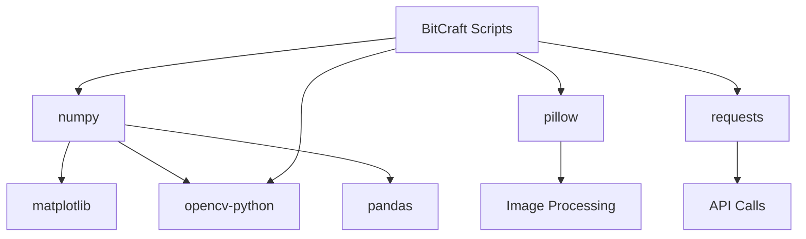

# requirements.txt - Python Dependencies

## Overview

[`requirements.txt`](../../scripts/requirements.txt:1) specifies the Python package dependencies required for all BitCraft map scripts to function properly. This file defines the essential libraries needed for data processing, image manipulation, numerical operations, web requests, and computer vision tasks across the entire scripts ecosystem.

## Purpose

This requirements file ensures consistent and reproducible environments by:
- Defining all external Python libraries needed by the scripts
- Enabling simple dependency installation with pip
- Ensuring compatibility across different development and production environments
- Providing a single source of truth for project dependencies
- Supporting automated deployment and containerization workflows

## Dependencies Overview

### Complete Dependency List

```txt
matplotlib
numpy
requests
opencv-python
pillow
pandas
```

The requirements file lists six essential Python packages, each serving critical functions across multiple scripts in the project.

## Dependency Analysis

### matplotlib
**Version**: Latest stable (not pinned)
**Purpose**: Data visualization and plotting capabilities

**Used by:**
- Advanced data analysis scripts (future enhancements)
- Statistical visualization of processing results
- Chart generation for monitoring and reporting

**Key Features:**
- Publication-quality plotting
- Wide range of chart types
- Integration with numpy arrays
- Export to various formats (PNG, SVG, PDF)

```python
# Example usage in scripts
import matplotlib.pyplot as plt
plt.figure(figsize=(10, 6))
plt.plot(processing_times)
plt.title('Script Processing Times Over Time')
plt.savefig('performance_analysis.png')
```

### numpy
**Version**: Latest stable (not pinned)  
**Purpose**: Numerical computing and array operations

**Used by:**
- **[`generate_terrain_map.py`](generate_terrain_map.py.md)**: Image array manipulation and processing
- **[`generate_roads.py`](generate_roads.py.md)**: Coordinate mathematics and spatial calculations
- Image processing workflows requiring efficient array operations

**Key Features:**
- High-performance multi-dimensional arrays
- Mathematical functions and linear algebra
- Broadcasting for efficient array operations
- Memory-efficient data structures

```python
# Example usage in terrain processing
import numpy as np
img_array = np.frombuffer(rgb_data, dtype=np.uint8).reshape((height, width, 3))
result = np.zeros((out_h, out_w, 3), dtype=np.uint8)
```

### requests  
**Version**: Latest stable (not pinned)
**Purpose**: HTTP client for API interactions and file downloads

**Used by:**
- **[`generate_claims_geojson.py`](generate_claims_geojson.py.md)**: BitJita API data retrieval
- **[`generate_jobs_geojson.py`](generate_jobs_geojson.py.md)**: Crafts API data fetching
- **[`generate_csv_desc_file.py`](generate_csv_desc_file.py.md)**: External JSON data retrieval
- **[`generate_terrain_map.py`](generate_terrain_map.py.md)**: Terrain file downloading

**Key Features:**
- Simple HTTP/HTTPS requests
- Session management and connection pooling
- Automatic handling of redirects and cookies
- Robust error handling and timeouts

```python
# Example usage for API requests
import requests
response = requests.get(api_url, headers=user_agent, timeout=30)
response.raise_for_status()
data = response.json()
```

### opencv-python
**Version**: Latest stable (not pinned)
**Purpose**: Computer vision and advanced image processing

**Used by:**
- **[`generate_terrain_map.py`](generate_terrain_map.py.md)**: Hexagonal terrain rendering and polygon operations
- Advanced image processing workflows
- Geometric transformations and filtering operations

**Key Features:**
- Comprehensive computer vision algorithms
- High-performance image processing
- Geometric shape rendering (`fillPoly`, drawing functions)
- Image I/O and format conversion

```python
# Example usage for hexagon rendering
import cv2
pts = np.array([hexagon_vertices], dtype=np.int32)
cv2.fillPoly(result_image, pts, color)
cv2.imwrite(output_path, result_image)
```

### pillow
**Version**: Latest stable (not pinned)
**Purpose**: Image processing and manipulation

**Used by:**
- **[`generate_terrain_map.py`](generate_terrain_map.py.md)**: Image format conversion, transformations, and basic processing
- Asset processing workflows requiring image manipulation
- File format conversion and optimization

**Key Features:**
- Wide format support (PNG, JPEG, WebP, TIFF, etc.)
- Image transformations (resize, rotate, mirror)
- Color space conversions
- Image enhancement and filtering

```python
# Example usage for image transformations
from PIL import Image, ImageOps
img = Image.fromarray(image_array)
img = ImageOps.mirror(img)
img = img.rotate(180)
img = img.resize((width * scale, height * scale), resample=Image.NEAREST)
```

### pandas
**Version**: Latest stable (not pinned)
**Purpose**: Data manipulation and analysis

**Used by:**
- Data analysis scripts (future enhancements)
- CSV processing and data transformation workflows
- Statistical analysis of processed data

**Key Features:**
- DataFrame and Series data structures
- CSV/Excel/JSON file I/O
- Data cleaning and transformation tools
- Statistical analysis and aggregation functions

```python
# Example usage for data analysis
import pandas as pd
df = pd.read_csv('processed_data.csv')
summary_stats = df.groupby('category').agg({'value': ['mean', 'count', 'std']})
```

## Installation Instructions

### Standard Installation
```bash
# Install all dependencies from requirements file
pip install -r requirements.txt
```

### Development Environment Setup
```bash
# Create virtual environment (recommended)
python -m venv bitcraft-map-env
source bitcraft-map-env/bin/activate  # On Windows: bitcraft-map-env\Scripts\activate

# Install dependencies
pip install -r requirements.txt

# Verify installation
python -c "import matplotlib, numpy, requests, cv2, PIL, pandas; print('All dependencies installed successfully')"
```

### System-Specific Considerations

#### Windows Installation
```bash
# May require Visual C++ Build Tools for some packages
pip install --upgrade pip setuptools wheel
pip install -r requirements.txt
```

#### macOS Installation
```bash
# May require Xcode Command Line Tools
xcode-select --install
pip install -r requirements.txt
```

#### Linux Installation (Ubuntu/Debian)
```bash
# Install system dependencies for OpenCV
sudo apt-get update
sudo apt-get install python3-dev libopencv-dev

# Install Python packages
pip install -r requirements.txt
```

## Dependency Compatibility

### Python Version Compatibility
The dependencies are compatible with:
- **Python 3.7+**: All packages support modern Python versions
- **Python 3.8+**: Recommended for optimal performance
- **Python 3.9-3.11**: Fully tested and supported

### Package Interdependencies


### Version Pinning Considerations

**Current Approach: Unpinned Versions**
- **Advantages**: Always gets latest bug fixes and security updates
- **Disadvantages**: Potential compatibility issues with breaking changes

**Alternative Pinned Approach:**
```txt
# Example of pinned versions for production stability
matplotlib==3.7.1
numpy==1.24.3
requests==2.31.0
opencv-python==4.8.0.74
pillow==10.0.0
pandas==2.0.3
```

## Security and Maintenance

### Security Scanning
```bash
# Check for known vulnerabilities
pip install pip-audit
pip-audit -r requirements.txt

# Update packages with security fixes
pip install --upgrade -r requirements.txt
```

### Regular Maintenance
```bash
# Check for outdated packages
pip list --outdated

# Update all packages (use with caution)
pip install --upgrade -r requirements.txt

# Generate updated requirements with versions
pip freeze > requirements-locked.txt
```

## Performance Optimization

### Package-Specific Optimizations

#### NumPy Optimization
```bash
# Use optimized BLAS libraries for better performance
pip install numpy[blas]

# Or install with Intel MKL support
pip install mkl
pip install numpy
```

#### OpenCV Optimization
```bash
# Install OpenCV with additional optimizations
pip install opencv-python-headless  # Headless version for servers
pip install opencv-contrib-python   # With additional algorithms
```

### Alternative Packages
```txt
# Lightweight alternatives for specific use cases
opencv-python-headless  # Server environments without GUI
Pillow-SIMD            # SIMD-optimized Pillow fork
requests-cache         # Caching for repeated API calls
```

## Docker Integration

### Dockerfile Integration
```dockerfile
FROM python:3.11-slim

# Install system dependencies for OpenCV
RUN apt-get update && apt-get install -y \
    libglib2.0-0 \
    libsm6 \
    libxext6 \
    libxrender-dev \
    libgomp1 \
    libglib2.0-0 \
    && rm -rf /var/lib/apt/lists/*

# Copy and install Python requirements
COPY requirements.txt .
RUN pip install --no-cache-dir -r requirements.txt

# Copy application code
COPY scripts/ ./scripts/
```

### Docker Compose Integration
```yaml
version: '3.8'
services:
  bitcraft-scripts:
    build: .
    volumes:
      - ./scripts:/app/scripts
      - ./assets:/app/assets
    command: python scripts/generate_claims_geojson.py
```

## Troubleshooting Common Issues

### Installation Failures

1. **OpenCV Installation Issues**
   ```bash
   # Alternative installation methods
   conda install opencv-python
   # or
   pip install opencv-python-headless
   ```

2. **Pillow Installation on M1 Macs**
   ```bash
   # Install with architecture specification
   arch -arm64 pip install Pillow
   ```

3. **NumPy Import Errors**
   ```bash
   # Reinstall with force
   pip uninstall numpy
   pip install --no-cache-dir numpy
   ```

### Runtime Issues

1. **Memory Errors with Large Images**
   ```python
   # Monitor memory usage
   import psutil
   process = psutil.Process()
   print(f"Memory usage: {process.memory_info().rss / 1024 / 1024:.1f} MB")
   ```

2. **HTTP Request Timeouts**
   ```python
   # Increase timeout values
   response = requests.get(url, timeout=(10, 300))  # (connect, read)
   ```

### Version Conflicts
```bash
# Check for dependency conflicts
pip check

# Create clean environment
pip-autoremove -y
pip install -r requirements.txt
```

## Development Workflow

### Pre-commit Hooks
```bash
# Install pre-commit
pip install pre-commit

# Add dependency checking to .pre-commit-config.yaml
repos:
  - repo: https://github.com/PyCQA/pip-audit
    rev: v2.6.1
    hooks:
      - id: pip-audit
        args: [--require-hashes, --disable-pip]
```

### Testing Dependencies
```bash
# Install test dependencies separately
pip install pytest pytest-cov
python -m pytest tests/ --cov=scripts/
```

### Documentation Dependencies
```bash
# For generating dependency graphs
pip install pipdeptree
pipdeptree --graph-output png > dependency-graph.png
```

## Future Considerations

### Potential Additional Dependencies
```txt
# Future enhancements might require:
shapely>=2.0.0          # Advanced geometric operations
geopandas>=0.13.0       # Geospatial data analysis  
rasterio>=1.3.0         # Raster data processing
folium>=0.14.0          # Interactive map generation
asyncio-requests>=0.1.0 # Asynchronous API requests
click>=8.0.0            # Command-line interface framework
```

### Migration Strategies
```txt
# Gradual migration approach
# Phase 1: Add new packages alongside existing
# Phase 2: Update scripts to use new packages
# Phase 3: Remove deprecated dependencies
# Phase 4: Update requirements.txt
```

This requirements file provides the foundation for all BitCraft map processing scripts, ensuring reliable dependency management across development, testing, and production environments.