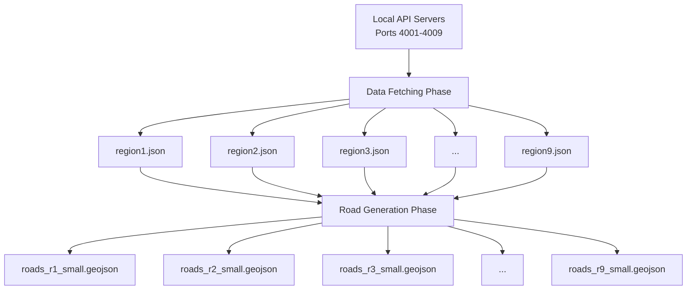

# roads.sh - Road Generation Automation Script

## Overview

[`roads.sh`](../../scripts/roads.sh:1) is a bash automation script that orchestrates the complete road generation workflow for BitCraft's multi-region world map. It fetches paved road coordinate data from local API endpoints and processes them through the hexagonal road generation pipeline to create web-ready GeoJSON files for all game regions.

## Purpose

This script addresses the complexity of multi-region road data processing by:
- Automating data retrieval from multiple regional API endpoints
- Coordinating batch processing across all nine game regions
- Standardizing road generation parameters across regions
- Providing a single-command solution for complete road network updates
- Ensuring consistent output naming and formatting

## Architecture Overview

### Multi-Region Processing Pipeline



## Script Components

### Data Fetching Phase
The script retrieves coordinate data from local API servers running on sequential ports:

```bash
curl -o region1.json http://localhost:4001/paved
curl -o region2.json http://localhost:4002/paved
curl -o region3.json http://localhost:4003/paved
curl -o region4.json http://localhost:4004/paved
curl -o region5.json http://localhost:4005/paved
curl -o region6.json http://localhost:4006/paved
curl -o region7.json http://localhost:4007/paved
curl -o region8.json http://localhost:4008/paved
curl -o region9.json http://localhost:4009/paved
```

**API Architecture:**
- **Regional Endpoints**: Each region has dedicated API server on sequential ports
- **Paved Data**: `/paved` endpoint provides coordinate data for constructed roads
- **Local Services**: APIs run locally, likely from game server data extraction tools
- **JSON Output**: Each endpoint returns coordinate arrays in JSON format

### Road Generation Phase
The script processes each region's coordinate data through the hexagonal road generator:

```bash
python ./scripts/generate_roads.py --mode fixed region1.json roads_r1_small.geojson
python ./scripts/generate_roads.py --mode fixed region2.json roads_r2_small.geojson
python ./scripts/generate_roads.py --mode fixed region3.json roads_r3_small.geojson
python ./scripts/generate_roads.py --mode fixed region4.json roads_r4_small.geojson
python ./scripts/generate_roads.py --mode fixed region5.json roads_r5_small.geojson
python ./scripts/generate_roads.py --mode fixed region6.json roads_r6_small.geojson
python ./scripts/generate_roads.py --mode fixed region7.json roads_r7_small.geojson
python ./scripts/generate_roads.py --mode fixed region8.json roads_r8_small.geojson
python ./scripts/generate_roads.py --mode fixed region9.json roads_r9_small.geojson
```

**Processing Parameters:**
- **Fixed Mode**: Uses consistent hexagon sizing across all regions
- **Input Pattern**: `regionN.json` files from data fetching phase
- **Output Pattern**: `roads_rN_small.geojson` for web map consumption
- **Python Path**: Executes from project root directory

## Regional Architecture

### BitCraft World Structure
The script reflects BitCraft's nine-region world organization:

| Region | Port | Description |
|--------|------|-------------|
| Region 1 | [4001](../../scripts/roads.sh:3) | Northwestern region |
| Region 2 | [4002](../../scripts/roads.sh:4) | Northern region |
| Region 3 | [4003](../../scripts/roads.sh:5) | Northeastern region |
| Region 4 | [4004](../../scripts/roads.sh:6) | Western region |
| Region 5 | [4005](../../scripts/roads.sh:7) | Central region |
| Region 6 | [4006](../../scripts/roads.sh:8) | Eastern region |
| Region 7 | [4007](../../scripts/roads.sh:9) | Southwestern region |
| Region 8 | [4008](../../scripts/roads.sh:10) | Southern region |
| Region 9 | [4009](../../scripts/roads.sh:11) | Southeastern region |

### Regional API Requirements
The script expects a specific local infrastructure:

```bash
# Required local API servers
# Each server should provide paved road coordinates for its region
http://localhost:4001/paved  # Returns JSON array of [x,y] coordinates
http://localhost:4002/paved  # Returns JSON array of [x,y] coordinates
# ... continuing through port 4009
```

## Usage and Execution

### Prerequisites
Before running the script, ensure:

1. **Local API Servers**: All regional API servers (ports 4001-4009) are running
2. **Python Environment**: Python with required dependencies installed
3. **Script Permissions**: Execute permissions set on roads.sh
4. **Working Directory**: Run from project root directory

### Direct Execution
```bash
# Make script executable (if needed)
chmod +x scripts/roads.sh

# Run complete road generation pipeline
./scripts/roads.sh
```

### Expected Output
```bash
# Data fetching phase
  % Total    % Received % Xferd  Average Speed   Time    Time     Time  Current
                                 Dload  Upload   Total   Spent    Left  Speed
100  1234    0  1234    0     0   1234      0 --:--:-- --:--:-- --:--:--  1234

# Road generation phase  
Loaded 456 points
Computing nearest-neighbor distances ...
Done computing per-point apothems.
Built 456/456 hexagons
Merging hexagons ...
Unioned batch 1/1 (batch size 456)
Wrote 1 polygon(s) → roads_r1_small.geojson

# ... repeating for all regions
```

### Generated Files
The script produces the following outputs:

**Intermediate Files (can be removed after processing):**
- `region1.json` through `region9.json`

**Final Output Files:**
- `roads_r1_small.geojson` through `roads_r9_small.geojson`

## Integration Patterns

### Web Map Integration
The generated road files integrate with the web map system:

```javascript
// Load all regional road networks
const roadLayers = {};
const regions = [1, 2, 3, 4, 5, 6, 7, 8, 9];

Promise.all(
    regions.map(region => 
        fetch(`roads_r${region}_small.geojson`)
            .then(response => response.json())
    )
).then(roadData => {
    regions.forEach((region, index) => {
        roadLayers[`region${region}`] = L.geoJSON(roadData[index], {
            style: {
                color: '#8B4513',      // Brown color for roads
                weight: 3,
                opacity: 0.8,
                fillOpacity: 0.4
            }
        });
    });
    
    // Add to layer control
    L.control.layers({}, roadLayers).addTo(map);
});
```

### Build System Integration
```bash
#!/bin/bash
# Complete map data pipeline

echo "Updating claims and POI data..."
python scripts/generate_claims_geojson.py
python scripts/static_poi_to_geojson.py

echo "Generating road networks..."
./scripts/roads.sh

echo "Processing terrain maps..."
python scripts/generate_terrain_map.py

echo "Updating web assets..."
python scripts/generate_icons_manifest.py

echo "Map data update complete!"
```

### Scheduled Automation
```bash
# Cron job for regular road network updates
# Runs daily at 3 AM when API servers are likely to be updated
0 3 * * * cd /path/to/bitcraftmap && ./scripts/roads.sh
```

## Error Handling and Debugging

### Common Issues and Solutions

1. **API Server Unavailable**
   ```bash
   # Check API server status
   curl -f http://localhost:4001/paved || echo "Region 1 API unavailable"
   
   # Test all endpoints
   for port in {4001..4009}; do
       echo -n "Port $port: "
       curl -sf http://localhost:$port/paved >/dev/null && echo "OK" || echo "FAIL"
   done
   ```

2. **Network Timeout Issues**
   ```bash
   # Add timeout to curl commands
   curl --connect-timeout 10 --max-time 30 -o region1.json http://localhost:4001/paved
   ```

3. **Python Script Failures**
   ```bash
   # Add error checking to road generation
   if ! python ./scripts/generate_roads.py --mode fixed region1.json roads_r1_small.geojson; then
       echo "Failed to process region 1"
       exit 1
   fi
   ```

### Enhanced Error Handling Version
```bash
#!/bin/bash
# Enhanced roads.sh with error handling

set -e  # Exit on any error

# Function to check API availability
check_api() {
    local port=$1
    if ! curl -sf "http://localhost:$port/paved" >/dev/null; then
        echo "Error: API server on port $port is not available"
        exit 1
    fi
}

# Check all API servers before starting
echo "Checking API server availability..."
for port in {4001..4009}; do
    check_api $port
done

echo "All API servers available. Starting data fetch..."

# Data fetching with error handling
for i in {1..9}; do
    port=$((4000 + i))
    echo "Fetching region $i data..."
    if ! curl --fail --connect-timeout 10 --max-time 30 -o "region$i.json" "http://localhost:$port/paved"; then
        echo "Failed to fetch data for region $i"
        exit 1
    fi
done

echo "Data fetch complete. Starting road generation..."

# Road generation with error handling
for i in {1..9}; do
    echo "Processing region $i roads..."
    if ! python ./scripts/generate_roads.py --mode fixed "region$i.json" "roads_r${i}_small.geojson"; then
        echo "Failed to generate roads for region $i"
        exit 1
    fi
done

echo "Road generation complete. Cleaning up temporary files..."

# Optional: Remove intermediate files
rm -f region{1..9}.json

echo "All regions processed successfully!"
```

## Performance Considerations

### Processing Time
- **Data Fetching**: 5-30 seconds depending on API response times
- **Road Generation**: 2-10 minutes per region depending on coordinate density
- **Total Time**: 20-90 minutes for complete nine-region processing

### Resource Usage
- **Network**: Depends on coordinate data size (typically 1-10MB per region)
- **CPU**: Intensive during hexagon generation and polygon union operations
- **Memory**: Peak usage during polygon processing (100-500MB per region)
- **Disk**: Intermediate files typically 50-200MB total

### Optimization Strategies

1. **Parallel Processing**
   ```bash
   # Process regions in parallel (requires sufficient resources)
   for i in {1..9}; do
       python ./scripts/generate_roads.py --mode fixed "region$i.json" "roads_r${i}_small.geojson" &
   done
   wait  # Wait for all background processes to complete
   ```

2. **Batch Size Optimization**
   ```bash
   # Adjust batch size based on system resources
   python ./scripts/generate_roads.py --mode fixed --batch 10000 "region$i.json" "roads_r${i}_small.geojson"
   ```

3. **Memory Management**
   ```bash
   # Process regions sequentially to manage memory usage
   # Add memory monitoring
   for i in {1..9}; do
       echo "Processing region $i (Memory: $(free -m | awk 'NR==2{printf "%.1f%%", $3*100/$2 }'))"
       python ./scripts/generate_roads.py --mode fixed "region$i.json" "roads_r${i}_small.geojson"
   done
   ```

## Configuration and Customization

### API Endpoint Customization
```bash
# Modify for different API configurations
BASE_URL="http://localhost"
START_PORT=4001
ENDPOINT="/paved"

for i in {1..9}; do
    port=$((START_PORT + i - 1))
    curl -o "region$i.json" "${BASE_URL}:${port}${ENDPOINT}"
done
```

### Output Customization
```bash
# Different output naming schemes
OUTPUT_PREFIX="roads_region"
OUTPUT_SUFFIX="_hexagonal.geojson"

for i in {1..9}; do
    python ./scripts/generate_roads.py --mode fixed "region$i.json" "${OUTPUT_PREFIX}${i}${OUTPUT_SUFFIX}"
done
```

### Road Generation Parameters
```bash
# Use different hexagon sizes per region
declare -a APOTHEMS=(0.3 0.4 0.5 0.4 0.3 0.4 0.5 0.4 0.3)

for i in {1..9}; do
    apothem=${APOTHEMS[$((i-1))]}
    python ./scripts/generate_roads.py --mode fixed --apothem $apothem "region$i.json" "roads_r${i}_small.geojson"
done
```

## Monitoring and Maintenance

### Health Checks
```bash
#!/bin/bash
# Road generation health check script

echo "=== Road Generation Health Check ==="

# Check API servers
echo "Checking API servers..."
failed_apis=0
for port in {4001..4009}; do
    if curl -sf "http://localhost:$port/paved" >/dev/null 2>&1; then
        echo "✓ Port $port: OK"
    else
        echo "✗ Port $port: FAILED"
        ((failed_apis++))
    fi
done

# Check output files
echo "Checking output files..."
missing_files=0
for i in {1..9}; do
    if [ -f "roads_r${i}_small.geojson" ]; then
        size=$(stat -f%z "roads_r${i}_small.geojson" 2>/dev/null || stat -c%s "roads_r${i}_small.geojson")
        echo "✓ Region $i: $size bytes"
    else
        echo "✗ Region $i: Missing"
        ((missing_files++))
    fi
done

echo "=== Summary ==="
echo "Failed APIs: $failed_apis/9"
echo "Missing files: $missing_files/9"

if [ $failed_apis -eq 0 ] && [ $missing_files -eq 0 ]; then
    echo "✓ All systems operational"
    exit 0
else
    echo "✗ Issues detected"
    exit 1
fi
```

### Log Analysis
```bash
# Run with logging
./scripts/roads.sh 2>&1 | tee roads_generation.log

# Analyze processing times
grep "Built.*hexagons" roads_generation.log | \
    sed 's/.*Built \([0-9]*\)\/\1 hexagons.*/\1/' | \
    awk '{sum+=$1} END {print "Average hexagons per region:", sum/NR}'
```

## Future Enhancements

### Potential Improvements
- **Configuration File**: External configuration for API endpoints and parameters
- **Error Recovery**: Automatic retry mechanisms for failed operations
- **Progress Monitoring**: Real-time progress reporting during processing
- **Differential Updates**: Only process regions with changed data
- **Quality Validation**: Automated validation of generated road networks
- **Performance Metrics**: Detailed timing and resource usage reporting

### Advanced Features
```bash
# Intelligent region selection based on data freshness
check_region_freshness() {
    local region=$1
    local api_modified=$(curl -sI "http://localhost:$((4000+region))/paved" | grep -i last-modified)
    local file_modified=$(stat -f %m "roads_r${region}_small.geojson" 2>/dev/null || echo 0)
    
    # Compare timestamps and return true if update needed
    # Implementation would parse dates and compare
}

# Process only regions that need updates
for i in {1..9}; do
    if check_region_freshness $i; then
        echo "Updating region $i..."
        # Process region
    else
        echo "Region $i is up to date, skipping..."
    fi
done
```

This automation script provides essential batch processing capabilities for BitCraft's multi-region road network generation, ensuring consistent and efficient processing across all game regions.