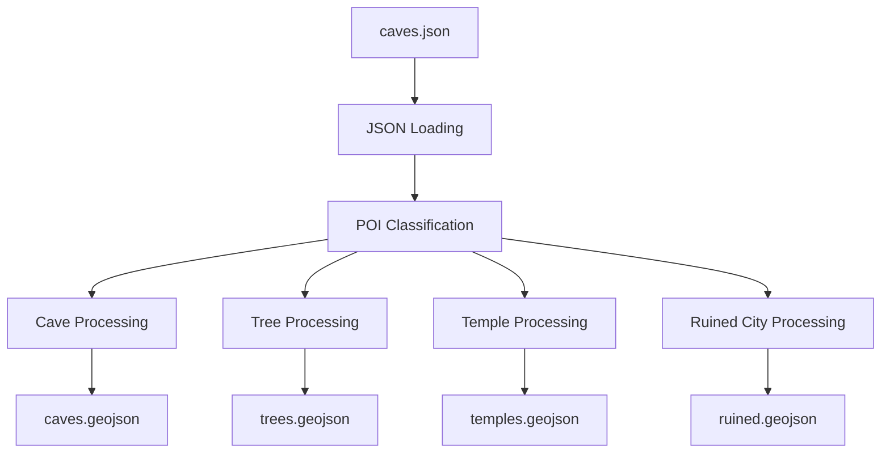

# static_poi_to_geojson.py - POI Conversion Utility

## Overview

[`static_poi_to_geojson.py`](../../scripts/static_poi_to_geojson.py:1) is a specialized data conversion utility that processes Points of Interest (POI) data from BitCraft game files and generates multiple categorized GeoJSON files. This script intelligently parses mixed POI data and separates it into distinct categories for optimized web map rendering.

## Purpose

This script addresses the complexity of BitCraft's mixed POI data by:
- Parsing a unified POI data source containing multiple location types
- Categorizing locations based on naming patterns and content analysis
- Generating separate GeoJSON files for different POI categories
- Enriching cave data with tier and size information for gameplay relevance
- Creating web-ready marker data with appropriate categorization

## Architecture Overview

### Data Processing Pipeline



## Core Functionality

### POI Classification System
The script uses intelligent name-based classification to categorize different POI types:

```python
# Cave identification
if 'Cave' not in json_key['name']:
    return None

# Tree identification  
if 'Tree' not in json_key['name']: 
    return None

# Temple identification
if 'Temple' not in json_key['name']:
    return None

# Ruined city identification (exclusion-based)
if any(keyword in json_key['name'] for keyword in ['Tree', 'Cave', 'Temple']):
    return None
```

**Classification Logic:**
- **Explicit Matching**: Cave, Tree, Temple POIs identified by name keywords
- **Exclusion-Based**: Ruined cities identified by excluding other categories
- **Pattern Recognition**: Names follow consistent game naming conventions

### Cave Data Processing
The [`generate_caves_geojson()`](../../scripts/static_poi_to_geojson.py:3) function implements sophisticated cave analysis:

```python
def generate_caves_geojson(json_key):
    ore_tiers = {
       1: 'Ferralith',    2: 'Pyrelite',     3: 'Emarium',
       4: 'Elenvar',      5: 'Luminite',     6: 'Rathium',
       7: 'Aurumite',     8: 'Celestium',    9: 'Umbracite',
       10: 'Astralite'
    }
    
    size = 2 if 'Large' in json_key['name'] else 1
    
    for tier_id, tier_name in ore_tiers.items():
        if tier_name in json_key['name']:
            tier = tier_id
            break
```

**Cave Analysis Features:**
- **Tier Detection**: Extracts ore tier (1-10) from cave names
- **Size Classification**: Identifies large vs. standard caves
- **Resource Mapping**: Maps ore names to numerical tiers for game balance
- **Metadata Enrichment**: Provides gameplay-relevant information

### Ore Tier System
The script implements BitCraft's comprehensive ore hierarchy:

| Tier | Ore Name | Rarity | Typical Depth |
|------|----------|--------|---------------|
| 1 | [Ferralith](../../scripts/static_poi_to_geojson.py:6) | Common | Surface |
| 2 | [Pyrelite](../../scripts/static_poi_to_geojson.py:7) | Common | Shallow |
| 3 | [Emarium](../../scripts/static_poi_to_geojson.py:8) | Uncommon | Mid-level |
| 4 | [Elenvar](../../scripts/static_poi_to_geojson.py:9) | Uncommon | Mid-level |
| 5 | [Luminite](../../scripts/static_poi_to_geojson.py:10) | Rare | Deep |
| 6 | [Rathium](../../scripts/static_poi_to_geojson.py:11) | Rare | Deep |
| 7 | [Aurumite](../../scripts/static_poi_to_geojson.py:12) | Epic | Very Deep |
| 8 | [Celestium](../../scripts/static_poi_to_geojson.py:13) | Epic | Very Deep |
| 9 | [Umbracite](../../scripts/static_poi_to_geojson.py:14) | Legendary | Deepest |
| 10 | [Astralite](../../scripts/static_poi_to_geojson.py:15) | Mythic | Deepest |

### Tree Processing
The [`generate_trees_geojson()`](../../scripts/static_poi_to_geojson.py:41) function handles arboreal POIs:

```python
def generate_trees_geojson(json_key):
    if 'Tree' not in json_key['name']: 
        return None

    return {
        "type": "Feature",
        "properties": {
            "name": json_key['name'],
        },
        "geometry": {
            "type": "Point",
            "coordinates": [json_key['location']['x'], json_key['location']['z']]
        }
    }
```

**Tree Features:**
- **Simple Classification**: Basic name-based identification
- **Minimal Metadata**: Only stores name information
- **Standard Coordinates**: Uses game world X/Z coordinate system

### Temple Processing
The [`generate_temples_geojson()`](../../scripts/static_poi_to_geojson.py:56) function processes religious sites:

```python
def generate_temples_geojson(json_key):
    if 'Temple' not in json_key['name']:
        return None

    return {
        "type": "Feature",
        "properties": {
            "name": json_key['name']
        },
        "geometry": {
            "type": "Point",
            "coordinates": [json_key['location']['x'], json_key['location']['z']]
        }
    }
```

**Temple Characteristics:**
- **Cultural Significance**: Marks important religious/cultural sites
- **Navigation Aids**: Provides landmarks for player orientation
- **Quest Integration**: Often connected to game storylines

### Ruined City Processing
The [`generate_ruined_geojson()`](../../scripts/static_poi_to_geojson.py:71) function uses exclusion logic:

```python
def generate_ruined_geojson(json_key):
    # Ruined cities have non descriptive names
    if any(keyword in json_key['name'] for keyword in ['Tree', 'Cave', 'Temple']):
        return None

    return {
        "type": "Feature",
        "properties": {
            "name": json_key['name'],
        },
        "geometry": {
            "type": "Point",
            "coordinates": [json_key['location']['x'], json_key['location']['z']]
        }
    }
```

**Ruined City Logic:**
- **Exclusion-Based**: Identified by NOT being other POI types
- **Historical Significance**: Represents abandoned settlements
- **Exploration Targets**: Often contain valuable resources or lore

## Data Schema and Structure

### Input Schema (caves.json)
```json
[
  {
    "name": "Large Ferralith Cave",
    "location": {
      "x": 12345.67,
      "z": 23456.78
    }
  },
  {
    "name": "Ancient Temple of Wisdom",
    "location": {
      "x": 34567.89,
      "z": 45678.90
    }
  }
]
```

### Output Schema Examples

#### Cave GeoJSON
```json
{
  "type": "Feature",
  "properties": {
    "name": "Large Ferralith Cave",
    "size": 2,
    "tier": 1
  },
  "geometry": {
    "type": "Point",
    "coordinates": [12345.67, 23456.78]
  }
}
```

#### Temple GeoJSON
```json
{
  "type": "Feature", 
  "properties": {
    "name": "Ancient Temple of Wisdom"
  },
  "geometry": {
    "type": "Point",
    "coordinates": [34567.89, 45678.90]
  }
}
```

## File Processing and Output

### Input File Processing
```python
with open('assets/data/caves.json', 'r', encoding='utf-8') as file:
    data = json.load(file)
```

**Input Processing:**
- **UTF-8 Encoding**: Ensures proper handling of international characters
- **Single Source**: Processes unified POI data from caves.json
- **Memory Loading**: Loads entire dataset for processing

### Output File Generation
The script generates four distinct GeoJSON files:

```python
# Cave data processing
with open('assets/markers/caves.geojson', 'w') as file:
    caves_json = [generate_caves_geojson(key) for key in data if generate_caves_geojson(key) is not None]
    json.dump(caves_json, file)

# Tree data processing  
with open('assets/markers/trees.geojson', 'w') as file:
    trees_json = [generate_trees_geojson(key) for key in data if generate_trees_geojson(key) is not None]
    json.dump(trees_json, file)

# Temple data processing
with open('assets/markers/temples.geojson', 'w') as file:
    temples_json = [generate_temples_geojson(key) for key in data if generate_temples_geojson(key) is not None]
    json.dump(temples_json, file)

# Ruined city processing
with open('assets/markers/ruined.geojson', 'w') as file:
    ruined_json = [generate_ruined_geojson(key) for key in data if generate_ruined_geojson(key) is not None]
    json.dump(ruined_json, file)
```

**Output Files:**
- **`assets/markers/caves.geojson`**: Cave locations with tier and size data
- **`assets/markers/trees.geojson`**: Tree/forest POI locations  
- **`assets/markers/temples.geojson`**: Religious/cultural site locations
- **`assets/markers/ruined.geojson`**: Abandoned settlement locations

## Usage Examples

### Direct Execution
```bash
python scripts/static_poi_to_geojson.py
```

### Web Map Integration
```javascript
// Load cave markers with tier-based styling
fetch('assets/markers/caves.geojson')
  .then(response => response.json())
  .then(caveData => {
    L.geoJSON(caveData, {
      pointToLayer: function(feature, latlng) {
        const tier = feature.properties.tier;
        const size = feature.properties.size;
        
        return L.marker(latlng, {
          icon: L.icon({
            iconUrl: `assets/images/ore/t${tier}.png`,
            iconSize: size === 2 ? [40, 40] : [30, 30]  // Large caves get bigger icons
          })
        });
      },
      onEachFeature: function(feature, layer) {
        const props = feature.properties;
        const popup = `
          <b>${props.name}</b><br/>
          Tier: ${props.tier}<br/>
          Size: ${props.size === 2 ? 'Large' : 'Standard'}
        `;
        layer.bindPopup(popup);
      }
    }).addTo(map);
  });

// Load other POI types
Promise.all([
  fetch('assets/markers/trees.geojson').then(r => r.json()),
  fetch('assets/markers/temples.geojson').then(r => r.json()),
  fetch('assets/markers/ruined.geojson').then(r => r.json())
]).then(([trees, temples, ruined]) => {
  // Add each POI type to appropriate map layers
  addTreesLayer(trees);
  addTemplesLayer(temples); 
  addRuinedLayer(ruined);
});
```

## Performance Characteristics

### Processing Efficiency
- **Memory Usage**: Minimal - processes data in single pass
- **Processing Speed**: <1 second for typical POI datasets (100-1000 locations)
- **I/O Operations**: Single read, four write operations
- **File Sizes**: Individual GeoJSON files typically 1-50KB each

### Classification Performance
- **Name Matching**: O(1) string operations per POI
- **Tier Detection**: O(1) dictionary lookup per cave
- **Categorization**: Linear scan through POI list

## Dependencies

### Required Modules
- **[`json`](../../scripts/static_poi_to_geojson.py:1)**: JSON parsing and serialization

### No External Dependencies
Uses only Python standard library for maximum compatibility.

## Error Handling and Validation

### Common Issues and Solutions

1. **Missing Input File**
   ```python
   import os
   if not os.path.exists('assets/data/caves.json'):
       raise FileNotFoundError("caves.json not found - ensure data file exists")
   ```

2. **Invalid Coordinate Data**
   ```python
   def validate_coordinates(location):
       x, z = location.get('x'), location.get('z')
       if x is None or z is None:
           raise ValueError("Missing coordinate data")
       if not (-50000 <= x <= 50000) or not (-50000 <= z <= 50000):
           print(f"Warning: Coordinates may be out of range: {x}, {z}")
   ```

3. **Encoding Issues**
   ```python
   try:
       with open('assets/data/caves.json', 'r', encoding='utf-8') as file:
           data = json.load(file)
   except UnicodeDecodeError:
       # Try alternative encodings
       with open('assets/data/caves.json', 'r', encoding='latin-1') as file:
           data = json.load(file)
   ```

## Customization Options

### Extended Cave Analysis
```python
def generate_enhanced_caves_geojson(json_key):
    """Enhanced cave processing with additional metadata"""
    
    # Existing tier and size detection
    tier = detect_ore_tier(json_key['name'])
    size = detect_cave_size(json_key['name'])
    
    # Additional analysis
    danger_level = calculate_danger_level(tier, size)
    resource_value = estimate_resource_value(tier, size)
    accessibility = assess_accessibility(json_key['location'])
    
    return {
        "type": "Feature",
        "properties": {
            "name": json_key['name'],
            "tier": tier,
            "size": size,
            "danger_level": danger_level,
            "resource_value": resource_value,
            "accessibility": accessibility
        },
        "geometry": {
            "type": "Point",
            "coordinates": [json_key['location']['x'], json_key['location']['z']]
        }
    }
```

### Custom POI Categories
```python
def generate_custom_poi_categories(data):
    """Create additional POI categories based on naming patterns"""
    
    # Watchtowers
    watchtowers = [poi for poi in data if 'Watchtower' in poi['name']]
    
    # Bridges  
    bridges = [poi for poi in data if 'Bridge' in poi['name']]
    
    # Camps
    camps = [poi for poi in data if 'Camp' in poi['name']]
    
    return {
        'watchtowers': watchtowers,
        'bridges': bridges,
        'camps': camps
    }
```

### Dynamic Categorization
```python
def auto_categorize_poi(poi_data):
    """Automatically detect POI categories from data"""
    categories = {}
    
    for poi in poi_data:
        name = poi['name']
        
        # Extract category from name patterns
        if any(ore in name for ore in ['Cave', 'Mine', 'Pit']):
            category = 'mining'
        elif any(religious in name for religious in ['Temple', 'Shrine', 'Chapel']):
            category = 'religious'
        elif any(natural in name for natural in ['Tree', 'Grove', 'Forest']):
            category = 'natural'
        else:
            category = 'other'
        
        if category not in categories:
            categories[category] = []
        categories[category].append(poi)
    
    return categories
```

## Integration Patterns

### Build System Integration
```python
def integrate_with_asset_pipeline():
    """Integrate POI processing with larger asset pipeline"""
    
    # Step 1: Process POI data
    process_static_pois()
    
    # Step 2: Validate outputs
    validate_poi_outputs()
    
    # Step 3: Update web map cache
    update_map_cache(['caves', 'trees', 'temples', 'ruined'])
    
    # Step 4: Generate search indices
    generate_poi_search_indices()
```

### Map Layer Management
```javascript
// Organize POI layers for map control
const poiLayers = {
    caves: L.layerGroup(),
    trees: L.layerGroup(),
    temples: L.layerGroup(),
    ruined: L.layerGroup()
};

// Load and organize POI data
function loadPOILayers() {
    const poiTypes = ['caves', 'trees', 'temples', 'ruined'];
    
    poiTypes.forEach(type => {
        fetch(`assets/markers/${type}.geojson`)
            .then(response => response.json())
            .then(data => {
                L.geoJSON(data, {
                    pointToLayer: (feature, latlng) => createPOIMarker(feature, latlng, type),
                    onEachFeature: (feature, layer) => bindPOIPopup(feature, layer, type)
                }).addTo(poiLayers[type]);
            });
    });
}

// Layer control for POI visibility
L.control.layers({}, {
    'Caves': poiLayers.caves,
    'Trees': poiLayers.trees,
    'Temples': poiLayers.temples,
    'Ruined Cities': poiLayers.ruined
}).addTo(map);
```

## Quality Assurance

### Output Validation
```python
def validate_poi_outputs():
    """Validate generated POI GeoJSON files"""
    poi_files = [
        'assets/markers/caves.geojson',
        'assets/markers/trees.geojson', 
        'assets/markers/temples.geojson',
        'assets/markers/ruined.geojson'
    ]
    
    for file_path in poi_files:
        if not os.path.exists(file_path):
            raise FileNotFoundError(f"Missing POI file: {file_path}")
        
        with open(file_path, 'r') as f:
            data = json.load(f)
            
        # Validate GeoJSON structure
        assert isinstance(data, list), f"Invalid structure in {file_path}"
        
        for feature in data:
            assert feature.get('type') == 'Feature', "Invalid feature type"
            assert 'properties' in feature, "Missing properties"
            assert 'geometry' in feature, "Missing geometry"
            assert feature['geometry']['type'] == 'Point', "Invalid geometry type"
```

### Data Quality Metrics
```python
def analyze_poi_distribution():
    """Analyze POI distribution for quality assurance"""
    with open('assets/data/caves.json', 'r') as f:
        source_data = json.load(f)
    
    # Count POIs by category
    categories = {
        'caves': len([p for p in source_data if 'Cave' in p['name']]),
        'trees': len([p for p in source_data if 'Tree' in p['name']]),
        'temples': len([p for p in source_data if 'Temple' in p['name']]),
        'other': 0
    }
    
    categories['other'] = len(source_data) - sum(categories.values())
    
    print("POI Distribution Analysis:")
    for category, count in categories.items():
        print(f"  {category.title()}: {count}")
        
    # Check for processing completeness
    total_processed = sum(categories.values())
    if total_processed != len(source_data):
        print(f"Warning: Processed {total_processed}/{len(source_data)} POIs")
```

## Future Enhancements

### Potential Improvements
- **Machine Learning Classification**: Automatic POI categorization using ML
- **Hierarchical Organization**: Sub-categories within main POI types
- **Temporal Data**: Support for time-based POI availability
- **Player Data Integration**: User-generated POI additions
- **Advanced Metadata**: Resource yield rates, accessibility ratings
- **Multi-language Support**: Localized POI names and descriptions

### Advanced Features
```python
# Spatial clustering for POI density analysis
def cluster_poi_locations(poi_data, cluster_radius=1000):
    """Group nearby POIs into clusters for overview display"""
    # Implementation would use spatial clustering algorithms

# Dynamic POI importance scoring
def calculate_poi_importance(poi, player_data):
    """Score POI importance based on player needs and location"""
    # Implementation would consider player level, location, resources needed

# POI relationship mapping
def map_poi_relationships(all_poi_data):
    """Identify relationships between different POI types"""
    # Implementation would find patterns like temples near caves
```

This script provides essential POI categorization and conversion capabilities for the BitCraft map, transforming mixed location data into organized, web-ready GeoJSON files with appropriate metadata for each POI category.