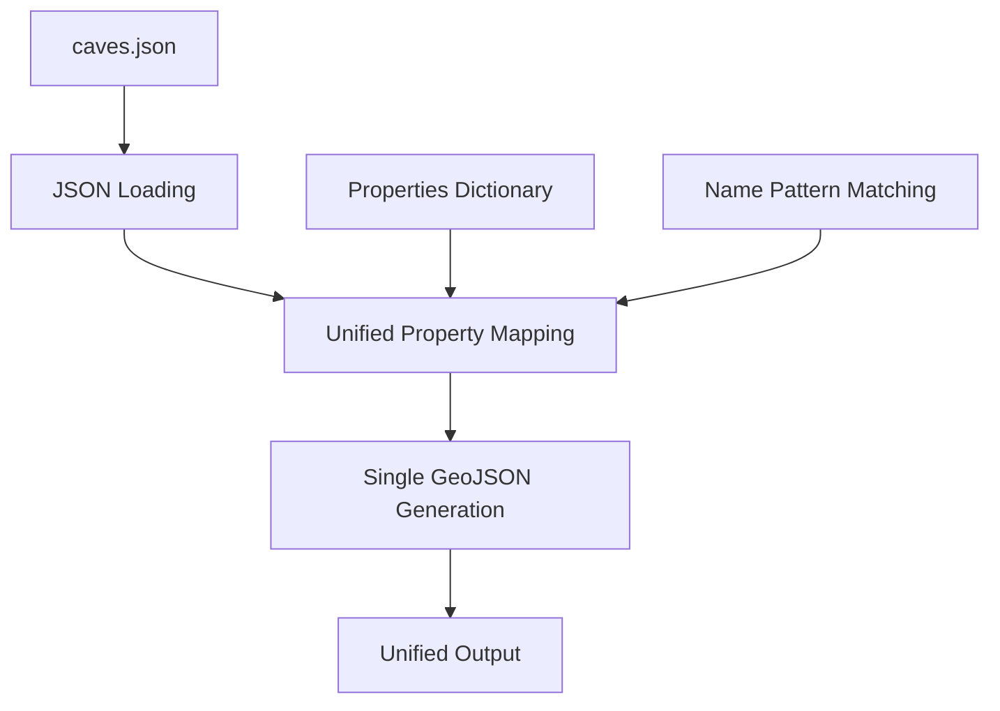

# static_poi_to_geojson_new.py - Updated POI Conversion (Experimental)

## Overview

[`static_poi_to_geojson_new.py`](../../scripts/static_poi_to_geojson_new.py:1) is an experimental rewrite of the POI conversion utility that attempts to provide a more unified approach to processing BitCraft Points of Interest data. This script represents a work-in-progress modernization of the original POI processing logic.

> **⚠️ Development Status**: This script is incomplete and experimental. It appears to be a partial rewrite that was not finished. Use [`static_poi_to_geojson.py`](static_poi_to_geojson.py.md) for production POI processing.

## Purpose

This script was intended to improve upon the original POI processing by:
- Providing a unified properties mapping system for all POI types
- Simplifying the categorization logic with a single processing function
- Using more consistent coordinate field names (`locationX`, `locationZ`)
- Implementing a more extensible architecture for adding new POI types

## Architecture Overview

### Intended Processing Pipeline



## Core Components

### Properties Mapping System
The script defines a comprehensive properties dictionary for POI classification:

```python
properties = {
    'Ferralith Cave': {"tier": 1, "iconName": "t1"},
    'Pyrelite Cave': {"tier": 2, "iconName": "t2"},
    'Emarium Cave': {"tier": 3, "iconName": "t3"},
    'Elenvar Cave': {"tier": 4, "iconName": "t4"},
    'Luminite Cave': {"tier": 5, "iconName": "t5"},
    'Rathium Cave': {"tier": 6, "iconName": "t6"},
    'Aurumite Cave': {"tier": 7, "iconName": "t7"},
    'Celestium Cave': {"tier": 8, "iconName": "t8"},
    'Umbracite Cave': {"tier": 9, "iconName": "t9"},
    'Astralite Cave': {"tier": 10, "iconName": "t10"},

    'First': {"tier": 1, "iconName": "temple"},
    'Second': {"tier": 2, "iconName": "temple"},
    'Third': {"tier": 3, "iconName": "temple"},
    'Fourth': {"tier": 4, "iconName": "temple"},
    'Fifth': {"tier": 5, "iconName": "temple"},

    'Tree': {"tier": 1, "iconName": "travelerTree"},
}
```

**Mapping Features:**
- **Cave Tiers**: Complete 1-10 tier system for ore caves
- **Temple Hierarchy**: Ordinal-based temple classification system
- **Tree Classification**: Basic tree POI identification
- **Icon Integration**: Direct mapping to icon asset names
- **Extensible Design**: Easy addition of new POI types and properties

### Property Retrieval Function
The [`get_property_from_name()`](../../scripts/static_poi_to_geojson_new.py:31) function attempts unified property lookup:

```python
def get_property_from_name(name):
    print('got name ' + name)
    for keyword, property in properties.items():
        if keyword in name:
            property.update({'test':'testeza'})
            print('sending ' + str(property))
            return property.update({'test':'testeza'})
```

**Issues with Current Implementation:**
- **Return Value Problem**: `dict.update()` returns `None`, not the updated dictionary
- **Debug Code**: Contains debugging print statements and test properties
- **Incomplete Logic**: Missing proper error handling for unmatched names
- **Side Effects**: Modifies the original properties dictionary

### Cave Size Detection
The [`get_cave_size_from_name()`](../../scripts/static_poi_to_geojson_new.py:39) function provides size classification:

```python
def get_cave_size_from_name(name):
    return 2 if 'Large' in name else 1
```

**Size Classification:**
- **Large Caves**: Size value 2 for caves containing "Large" in name
- **Standard Caves**: Size value 1 for all other caves
- **Binary Classification**: Simple two-tier size system

### GeoJSON Generation Function
The [`generate_poi_geojson()`](../../scripts/static_poi_to_geojson_new.py:42) function represents the intended unified approach:

```python
def generate_poi_geojson(json_key):
    properties = get_property_from_name(json_key['name'])
    return {
        "type": "Feature",
        "properties": properties,
        "geometry": {
            "type": "Point",
            "coordinates": [json_key['locationX'], json_key['locationZ']]
        }
    }
```

**Function Characteristics:**
- **Unified Processing**: Single function for all POI types
- **Dynamic Properties**: Properties determined by name matching
- **Coordinate System**: Uses `locationX`/`locationZ` field names
- **Incomplete Implementation**: Properties retrieval returns `None` due to bug

## Current Implementation Status

### Incomplete Features
The script is missing several critical components:

1. **Main Processing Loop**: No actual data processing or output generation
2. **Error Handling**: No validation or error recovery mechanisms  
3. **Output Generation**: No file writing or GeoJSON structure completion
4. **Testing**: No validation of the property matching logic

### Functional Issues

1. **Property Retrieval Bug**:
   ```python
   # Current (broken) implementation
   return property.update({'test':'testeza'})  # Returns None
   
   # Corrected implementation should be:
   property.update({'test':'testeza'})
   return property  # Return the modified dictionary
   ```

2. **Missing Processing**:
   ```python
   # Script loads data but doesn't process it
   with open(poi_json_file, 'r', encoding='utf-8') as file:
       data = json.load(file)
   
   # print(json.dumps(geojson))  # Commented out, incomplete
   ```

## Comparison with Original Script

### Architectural Differences

| Aspect | Original Script | New Script (Intended) |
|--------|----------------|----------------------|
| **Processing Approach** | Separate functions per POI type | Unified processing function |
| **Output Format** | Multiple categorized GeoJSON files | Single unified GeoJSON |
| **Property Mapping** | Hardcoded in processing functions | Centralized properties dictionary |
| **Coordinate Fields** | `location.x`, `location.z` | `locationX`, `locationZ` |
| **Extensibility** | Requires new functions for POI types | Add entries to properties dictionary |

### Advantages of New Approach (If Completed)
- **Simplified Maintenance**: Single properties dictionary to update
- **Unified Output**: Consistent GeoJSON structure across all POI types
- **Easier Extension**: Add new POI types by updating properties mapping
- **Reduced Code Duplication**: Single processing function handles all types

### Disadvantages of Current Implementation
- **Incomplete**: Missing critical functionality
- **Untested**: No validation of property matching logic
- **Buggy**: Property retrieval function returns `None`
- **No Output**: Doesn't generate usable GeoJSON files

## Potential Completion Strategy

### Required Fixes
```python
def get_property_from_name(name):
    """Fixed property retrieval function"""
    for keyword, property_template in properties.items():
        if keyword in name:
            # Create copy to avoid modifying original
            matched_properties = property_template.copy()
            
            # Add cave size if applicable
            if 'Cave' in name:
                matched_properties['size'] = get_cave_size_from_name(name)
                
            return matched_properties
    
    # Return default properties for unmatched POIs
    return {"tier": 0, "iconName": "unknown"}

def process_poi_data():
    """Complete processing implementation"""
    with open(poi_json_file, 'r', encoding='utf-8') as file:
        data = json.load(file)
    
    geojson = {
        "type": "FeatureCollection",
        "features": [generate_poi_geojson(poi) for poi in data]
    }
    
    with open('assets/markers/all_pois.geojson', 'w') as file:
        json.dump(geojson, file, indent=2)
    
    return geojson
```

### Enhanced Property System
```python
# More comprehensive properties mapping
properties = {
    # Caves with full metadata
    'Ferralith Cave': {
        "type": "cave",
        "tier": 1, 
        "iconName": "t1",
        "resource": "ferralith",
        "difficulty": "easy",
        "biome": "surface"
    },
    
    # Temples with hierarchical data
    'First Temple': {
        "type": "temple",
        "tier": 1,
        "iconName": "temple",
        "hierarchy": "first",
        "cultural_significance": "high"
    },
    
    # Trees with environmental data
    'Ancient Tree': {
        "type": "tree",
        "tier": 1,
        "iconName": "travelerTree", 
        "age": "ancient",
        "ecological_value": "high"
    }
}
```

## Integration Considerations

### Migration Path from Original Script
If this script were to be completed, migration would involve:

1. **Data Format Changes**: Update input data to use `locationX`/`locationZ`
2. **Output Structure Changes**: Modify web map code to handle unified GeoJSON
3. **Icon System Updates**: Ensure icon names match new mapping system
4. **Testing**: Comprehensive validation against original script outputs

### Web Map Integration Impact
```javascript
// Original integration (multiple files)
Promise.all([
    fetch('assets/markers/caves.geojson'),
    fetch('assets/markers/trees.geojson'),
    fetch('assets/markers/temples.geojson'),
    fetch('assets/markers/ruined.geojson')
]).then(results => {/* process separately */});

// New integration (single file)
fetch('assets/markers/all_pois.geojson')
    .then(response => response.json())
    .then(allPois => {
        // Filter by POI type as needed
        const caves = allPois.features.filter(f => f.properties.type === 'cave');
        const temples = allPois.features.filter(f => f.properties.type === 'temple');
        // ... process unified data
    });
```

## Recommendations

### Current Usage
- **Do not use in production**: Script is incomplete and contains bugs
- **Use original script**: [`static_poi_to_geojson.py`](static_poi_to_geojson.py.md) for actual POI processing
- **Reference only**: This script serves as a design reference for future improvements

### Development Completion
If continuing development of this approach:

1. **Fix Property Retrieval**: Correct the return value bug in `get_property_from_name()`
2. **Implement Processing Loop**: Add main processing and output generation
3. **Add Error Handling**: Implement validation and error recovery
4. **Testing**: Create comprehensive test suite comparing outputs with original
5. **Documentation**: Update coordinate field requirements and output format

### Alternative Approach
Consider a hybrid solution that maintains the original script's reliability while adopting the improved properties mapping system:

```python
# Hybrid approach: Enhanced original with centralized properties
def generate_caves_geojson_enhanced(json_key):
    base_properties = CAVE_PROPERTIES.get(extract_cave_type(json_key['name']), {})
    
    return {
        "type": "Feature",
        "properties": {
            **base_properties,  # Spread centralized properties
            "name": json_key['name'],
            "size": get_cave_size_from_name(json_key['name'])
        },
        "geometry": {
            "type": "Point",
            "coordinates": [json_key['location']['x'], json_key['location']['z']]
        }
    }
```

## Future Development

### If Resumed
This script represents valuable architectural improvements that could be completed:

- **Unified Processing**: Single processing pipeline for all POI types
- **Centralized Configuration**: Properties dictionary approach for easy maintenance
- **Extensible Design**: Simple addition of new POI types and properties
- **Consistent Output**: Unified GeoJSON structure across all POI categories

### Design Lessons
The approach demonstrates good architectural principles:
- **Separation of Concerns**: Properties separated from processing logic
- **Data-Driven Configuration**: Properties dictionary instead of hardcoded values
- **Unified Interface**: Single processing function for all POI types
- **Extensibility**: Easy addition of new POI types without code changes

This experimental script, while incomplete, provides valuable insights for future POI processing improvements and demonstrates a more maintainable architecture for handling diverse POI data types.